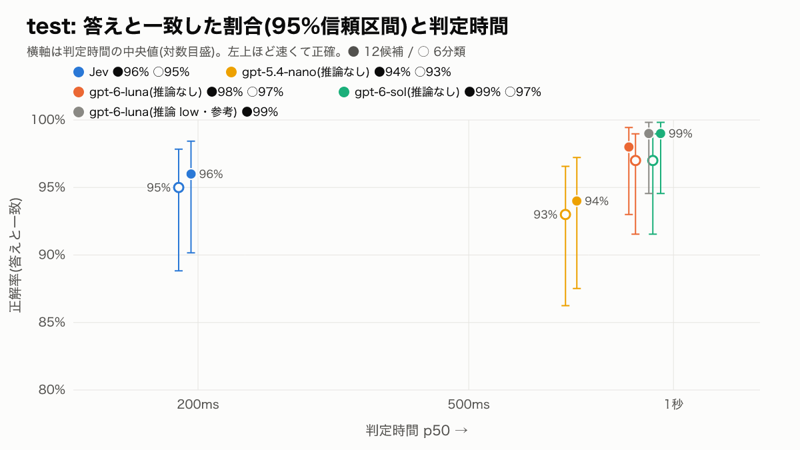

# jev-prompt-selection

求人相談AIエージェントの1枚岩のシステムプロンプトを分野ごとに分け、
**発話ごとに使うプロンプトを1つ、[TypeSafe](https://docs.typesafe.ai/) の System One モデル Jev に選ばせる**検証です。
v2 では LLM 分類器(gpt-5.4-nano / gpt-6-luna / gpt-6-sol)と比べ、v3 では評価の作り方を直して測り直しました(説明文と正解の基準をそろえる、評価用の発話を新しく作る、測定計画を先に凍結する、呼ぶ順番をランダムにする、リトライなし)。

- デモ: **https://jev-prompt-selection.milkmaccya2.workers.dev**
  - 「試す(Jev / Decisions API)」: 発話を入れると、Jev と OpenAI Decisions API(gpt-6-luna)に同じ指示文・候補で同時に聞き、選んだプロンプト・候補ごとの確率・confidence・判定時間を並べて表示します(12候補 / 6分類)
  - 「比較(100件)」: v4 の4構成(Jev・Decisions API・gpt-6-luna Chat・gpt-5.4-nano Chat、12候補 / 6分類)の正解率・判定時間・費用と、test 100件それぞれの正解と選択を見比べられます
- 結果の詳細: v4(4構成を同じ実行で比較)は [results/v4/summary.md](results/v4/summary.md)、v3 は [results/v3/summary.md](results/v3/summary.md)(測定計画は [results/v3/PLAN.md](results/v3/PLAN.md)、Decisions API の追加測定は [results/v3/appendix-decisions/summary.md](results/v3/appendix-decisions/summary.md)、v2 は [results/v2/summary.md](results/v2/summary.md)、v1 は [results/summary.md](results/summary.md))

> **すべて架空の合成データです。** サービス名「ハタラクラフト」、企業名(Kデジタル、Mフーズ など)は実在しません。

## 結果(v3、test 100件)

| 構成 | 粒度 | 答えと一致 [95%CI] | 別解込み | 判定時間 p50 / p95 | 費用 / 1000回 |
|---|---|---:|---:|---:|---:|
| Jev | 12候補 | 96% [90–98] | 98% | 0.20秒 / 0.29秒 | $0.086 |
| Jev | 6分類 | 95% [89–98] | 98% | 0.19秒 / 0.24秒 | $0.069 |
| gpt-5.4-nano(推論なし) | 12候補 | 94% [88–97] | 98% | 0.72秒 / 0.91秒 | $0.31 |
| gpt-6-luna(推論なし) | 12候補 | 98% [93–99] | 100% | 0.86秒 / 1.42秒 | $0.023〜0.187 |
| gpt-6-sol(推論なし) | 12候補 | 99% [95–100] | 100% | 0.96秒 / 1.32秒 | $0.46〜3.75 |

OpenAI の費用は「プロンプトキャッシュが毎回効く 〜 毎回切れる」の幅です(今回の実行は前者)。全9構成と dev(参考)は summary を見てください。

- **正解率は、Jev と各 LLM で差があるとは言えない。** 主な比較6組(12候補・6分類 × 3モデル)は、すべて Holm 補正後 p = 1.000。test は9構成すべてが93〜99%と易しく、差を判断するには件数が足りない
- **判定時間は Jev が3.5〜5倍速い**(1台の端末・1回の実行で測定)
- **費用は Jev が一番安いとは言えない。** gpt-6-luna はキャッシュのヒット率が62%以上なら Jev より安い。Jev は1回あたりの入力トークンも LLM より多い(2,049 対 1,442)
- **Jev の確信度0.9以上の81件は全件正解**だった
- v2 の「12候補は Jev が最も高い」は、v3 の dev では成り立たない(Jev 90%、gpt-6-sol 96%。この差も有意ではない)



**この結果から言えないこと**: test の発話は LLM(claude-sonnet-5-5)が作ったもので、dev より長く(平均29.3文字 対 15.8文字)、狙った分類と正解が100件すべて一致した。分類しやすい発話に寄っている可能性があります。正解は Claude Opus 5.5 が基準書 v3 から付けたラベルを人が確認したもの。応答の品質は測っていません。

### appendix: OpenAI Decisions API(2026-10-08)

v3 のあとで公開された OpenAI の Decisions API(`POST /v1/decisions`、パブリックベータ、モデルは gpt-6-luna のみ)を、v3 と同じ説明文・test・dev・手順で測りました。v3 本編の結果は変えていません。判定時間と費用は、同じ実行の中で呼び直した Jev・gpt-6-luna(Chat)と比べています。

| 構成(test 100件) | 粒度 | 答えと一致 [95%CI] | 判定時間 p50 / p95 | 費用 / 1000回 |
|---|---|---:|---:|---:|
| gpt-6-luna(Decisions API) | 12候補 | 97% [92–99] | 0.20秒 / 0.35秒 | $0.145 |
| Jev | 12候補 | 96% [90–98] | 0.18秒 / 0.23秒 | $0.086 |
| gpt-6-luna(Chat、推論なし) | 12候補 | 96% [90–98] | 1.22秒 / 1.88秒 | $0.028 |

- **正解率は Jev と差があるとは言えない**(12候補・6分類とも Holm 補正後 p = 1.000)
- **判定時間は Jev に近く、同じモデルを Chat で呼ぶより約5〜6倍速い**
- **費用は Jev の約1.7倍**(単価 $0.10 / 1M 対 $0.042 / 1M。入力トークンは Jev のほうが多い)
- 返すもの(選んだ候補・候補ごとの確率・確信度)は Jev とほぼ同じ。確信度0.9以上の77件は全件正解

詳細: [results/v3/appendix-decisions/summary.md](results/v3/appendix-decisions/summary.md)(計画は [PLAN.md](results/v3/appendix-decisions/PLAN.md))

## 仕組み

```
発話(+直前1〜2往復の会話)
   │
   ▼
Jev  POST /v1/systemone  ── choice 1問(12候補から1つ)
   │                        選択肢の説明 = 各プロンプトの「いつ使うか」
   ▼
選ばれたプロンプト + 確信度(0〜1)
   └─ Jev が使えないとき(API エラー)は基本プロンプト
```

### プロンプトの候補(12個)

システムプロンプト(約1,500行)を14の部品に分け、そこから候補を組み立てます。部品は `prompts/` にあります。

- **専用プロンプト 11個**: 常に載せる3部品(人格・安全・出力形式)+ 分野の部品1つ
  - 検索条件の聞き出し / 地名・職種の言い換え / 企業情報 / クチコミ / 給与・待遇 / キャリア相談 / 応募書類 / 面接対策 / ログイン・規約 / エラー時 / 範囲外の話題
- **基本プロンプト 1個**: 常に載せる3部品だけ。専用の指示がいらない発話(相づち、ツール操作だけで済む依頼など)用

各部品の frontmatter に書いた「1行の説明」と「必要なとき」が、そのまま Jev に渡す選択肢の説明になります。
ツール(求人検索・応募など)は常に渡す前提で、選択の対象外です。

### 評価セット(100件)

`data/eval.jsonl` の各件は、直前の会話・今回の発話・正解のプロンプト1つ(`answer`)・「これでも可」とする別解(`acceptable`)・タグを持ちます。

```json
{"id":"e040","context":[],"utterance":"面接で希望年収聞かれたらなんて答えればいい?",
 "answer":"interview_prep","acceptable":["salary_benefits"],"tags":["cross"]}
```

- 「これでも可」は、複数の分野にまたがる発話(27件)に、ラベルを付けるときに手で決めた別解です。閾値ではありません
- 口語・略称(34件)、直前の会話が必要(20件)、正解に迷いがある(18件)、範囲外の話題(9件)、誤字(5件)を含みます
- ラベルの基準: [data/LABELING.md](data/LABELING.md)

## 使い方

Node.js 22 以上と、TypeSafe の API キー(early access)が必要です。

```sh
npm install
cp .env.example .env            # TYPESAFE_API_KEY を設定(.env は gitignore 済み)
npm run check:data              # 評価セットの検証

npm run eval -- --limit 5 --dry-run           # 呼ばずに件数と費用の見込みだけ
npm run eval -- --limit 5 --budget-usd 0.05   # 5件で動作確認
npm run eval -- --budget-usd 0.20             # 100件(約 $0.01)
npm run report                                # results/summary.md, metrics.json, chart-part-miss.png

npm run web                                   # http://localhost:4319 でビューア

# v2: 比較(OPENAI_API_KEY / ANTHROPIC_API_KEY も使う)
npm run v2:label -- --budget-usd 4            # 基準書 v2 だけを見せて Claude が独立にラベル付け
npm run v2:agree                              # 元ラベルとの一致率・kappa・食い違い一覧
npm run v2:eval -- --limit 5 --budget-usd 0.2 # 5件で動作確認
npm run v2:eval -- --budget-usd 2             # 100件 × 9構成(1件ずつ順番、構成を交互に)
npm run v2:report                             # results/v2/summary.md とグラフ

# v3: 計画(results/v3/PLAN.md)どおりに測る
npm run v3:frozen                             # 凍結した入力のハッシュを確認
npm run v3:eval -- --set dev --limit 5 --smoke --budget-usd 0.10   # 5件で動作確認
npm run v3:eval -- --set test --budget-usd 1.50                    # test 100件 × 9構成
npm run v3:eval -- --set dev --budget-usd 1.50                     # dev 100件 × 9構成
npx tsx src/v3/report.ts                      # results/v3/summary.md・metrics.json・グラフ

# appendix: OpenAI Decisions API(results/v3/appendix-decisions/PLAN.md)
npx tsx --env-file=.env src/v3/evalAppendix.ts --set test --budget-usd 0.30   # Decisions・Jev・gpt-6-luna(Chat) × 12候補・6分類
npx tsx --env-file=.env src/v3/evalAppendix.ts --set dev --budget-usd 0.30
npx tsx src/v3/reportAppendix.ts              # results/v3/appendix-decisions/summary.md・グラフ
```

- `--budget-usd` で費用の上限を決められます。上限を超えそうな呼び出しの前で止まります
- `--configs choice_ja,choice_en,noul_ja` で、補足の聞き方(選択肢の説明を英語にした版、noul を11個聞いて最大値を取る版)も回せます。どちらも正解率は81〜83%で本編とほぼ同じでした
- プロンプトを直したら `npm run index` で `prompts/index.json`(行数・トークン数)を作り直します

## Cloudflare Workers へのデプロイ

```sh
npx wrangler login
# キーは Cloudflare 側にだけ置く(! で実行するときは対話入力できないのでパイプで渡す)
grep '^TYPESAFE_API_KEY=' .env | cut -d= -f2- | tr -d '\n' | npx wrangler secret put TYPESAFE_API_KEY
grep '^OPENAI_API_KEY=' .env | cut -d= -f2- | tr -d '\n' | npx wrangler secret put OPENAI_API_KEY
npm run cf:deploy               # worker/data.json を作ってからデプロイ
```

- `npm run cf:dev` でローカル確認できます(`.env` のキーを使います)
- 画面は `web/index.html`、API は `worker/index.ts`(`/api/data` と `/api/select`)です。評価結果は最新の `results/v4/raw/run-test-*.json` から焼き込みます。「試す」も v3 の指示文と説明文を使います
- 公開版の判定(`/api/select`)は、同じ IP から1分に20回までです(Workers の Rate Limiting、`wrangler.jsonc`)。1回の判定で Jev と Decisions API を1回ずつ呼びます。費用の上限は、TypeSafe と OpenAI のアカウント側の設定に任せています。入力は1〜300文字に制限しています

## ディレクトリ

| パス | 内容 |
|---|---|
| `prompts/` | プロンプト部品(常に載せる3 + 分野11)と `index.json` |
| `data/` | 評価セット(v1 `eval.jsonl` / v2 `eval.v2.jsonl` / v3 `eval.v3.test.jsonl`・`eval.v3.dev.jsonl`)、ラベル基準(`LABELING.md` / `LABELING.v2.md` / `LABELING.v3.md`)、v3 の説明文 `candidates.v3.json` |
| `src/jev.ts` | Jev への質問の組み立てと呼び出し、費用の上限 |
| `src/select.ts` | Jev の返り値からプロンプトを1つ決める |
| `src/eval.ts` / `src/report.ts` | 評価の実行 / 集計・グラフ・summary.md の生成 |
| `src/server.ts` / `web/index.html` | ローカル用ビューア |
| `worker/` | Cloudflare Workers 版 |
| `src/v2/` | v2 の候補定義・分類器(Jev / OpenAI)・ラベラー・統計・レポート |
| `src/v3/` | v3 の説明文・基準書の生成、test の作成、照合、ラベル付け、凍結の確認、評価の実行、レポート |
| `results/` | v1 の生データ・集計・グラフ / `results/v2/` に v2 一式 / `results/v3/` に v3 一式(計画 `PLAN.md`、凍結 `FROZEN.md`、料金 `PRICING.md` を含む) |

最初は「部品を複数選んで組み合わせる」構成で試しました。その生データは `results/raw/archive-multipart/` に残しています。

## 参考

- [TypeSafe docs: API reference](https://docs.typesafe.ai/api)
- [TypeSafe docs: Choice](https://docs.typesafe.ai/primitives/choice)
- [TypeSafe docs: Models & pricing](https://docs.typesafe.ai/models)
