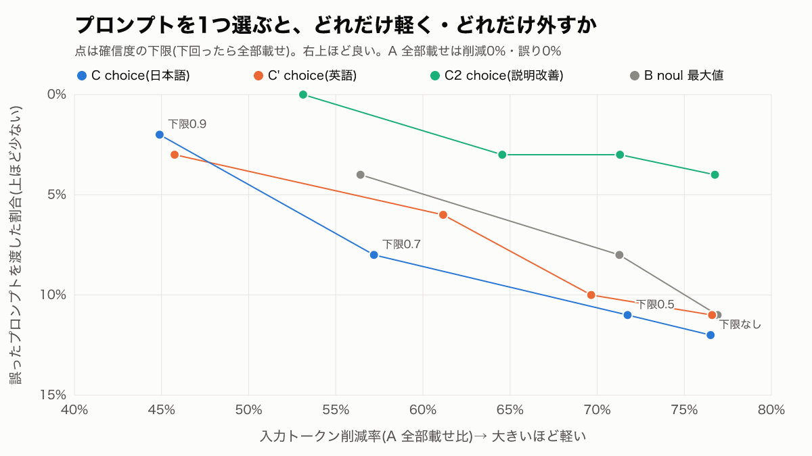
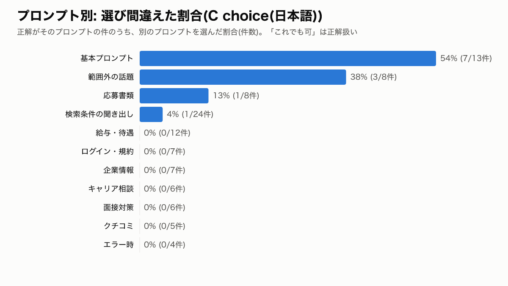

# 結果サマリー: Jev でシステムプロンプトを1つ選ぶ

- 実行: 2026-10-01T02:31:47.770Z / モデル: jev-1.13.0 / 件数: 100 / 費用(実績): $0.0349
- 候補: 専用プロンプト11個(常に載せる3部品 + 分野の部品1つ)+ 基本プロンプト(常に載せる3部品のみ)。全部載せは 22574 tok、基本プロンプトは 3719 tok
- 逃げ道: 確信度(choice の `confidence`)が下限未満、または API エラーなら全部載せ。B は noul の最大値が 0.5 以上ならその分野、未満なら基本プロンプト
- 正解率は「選んだプロンプト = 正解」、「これでも可」込みは複数分野にまたがる発話の別解も正解とする。誤ったプロンプト = どちらでもない
- トークン数は gpt-tokenizer(o200k)による近似。費用は Jev の `usage.input_tokens` × $0.042/Mtok

## わかったこと

- **choice でプロンプトを1つ選ぶと、正解率82%(「これでも可」込み88%)、入力を76.5%削減。** 誤ったプロンプトを渡したのは12件。
  1つ選ぶ方式での削減の上限は、基本プロンプトだけで83.5%、専用プロンプトで約74〜78%。
- **間違いは「専用の指示がいらない発話」の判定に集中した。** 分野がはっきりした発話(79件)で外したのは2件だけ。
  - 外した12件のうち10件は、「基本プロンプト」(13件中7件)と「範囲外の話題」(8件中3件)の取り違え
  - 例: 「はい」「ほかにもある?」に検索のプロンプトを選び、「ありがとう」「こんにちは」に基本プロンプトを選んだ
- **この2つの選択肢の説明を具体的に書き直す(C2)と、正解率91%(可込み96%)・誤り4件に下がった。**
  ただし、同じ100件の間違いを見て書き直したので、**この改善幅は楽観的**。別のデータでの確認が必要。
- **確信度で「迷ったら全部載せ」にすると、誤りは減るが削減も減る。**
  - C2 で下限0.5: 誤り3%・全部載せ7%・削減71%。バランスがよい
  - C で下限0.9: 誤り2%まで減るが、41%が全部載せになり削減は45%
  - 「はい」(0.96)、「ありがとう」(0.92)のように、確信度が高いまま外す件があり、下限だけでは防げない
- **日本語と英語の説明で正解率はほぼ同じ(82% / 83%)。** 英語は選択の入力が34%少ない(1,114 vs 1,682 tok/回)。
- **noul を11個聞いて最大値を取る方式は、choice と正解率が同程度で、入力が2.2倍。** 1つ選ぶなら choice で十分。
- **選択は速くて安い。** p50 約175ms・p95 約240ms、1000回で約$0.07。100件×4構成の評価全体で$0.035。
- **「地名・職種の言い換え」が主になる発話は0件。** 必ず検索とセットで出てくるので、1つ選ぶ設計なら検索プロンプトに統合するのが自然。

## 言えないこと・データの偏り

- **評価データは合成で、プロンプトを書いた本人が発話もラベルも作っている。** 実際の発話では精度が下がるおそれがある。ラベルの二重チェックもしていない。
- **C2 の説明は、この100件の間違いを見て直した。** 検証用データを分けていないので、C2 の数字はそのまま一般化できない。
- **件数が少ない。** 正解が「範囲外」は8件、「エラー時」は4件しかなく、1件で10ポイント以上動く。
- **「基本プロンプト」の範囲は、今回の設計上の決め(ツール操作・相づち・安全の部品で足りる相談)。** 実際のシステムでの扱いに合わせて決め直す必要がある。
- **応答の品質は測っていない。** 間違ったプロンプトを渡したとき、回答がどれだけ悪くなるかは未検証。
- **トークン削減 ≠ 費用削減。** 発話ごとにプロンプトが変わると、本番 LLM のプロンプトキャッシュが効きにくくなる。ただし候補が12個に限られるので、候補ごとのキャッシュは効く可能性がある。
- トークン数は o200k による近似。結果は `jev-1.13.0` のもの。

## 比較表(逃げ道なし)

| 構成 | 正解率 | 「これでも可」込み | 誤ったプロンプト | 全部載せに倒した | 削減率 | 選択 p50 / p95 | 選択の入力 tok/回 | 費用 /1000回 |
|---|---:|---:|---:|---:|---:|---:|---:|---:|
| A 全部載せ | - | - | 0.0% | 100.0% | 0.0% | - / - | - | - |
| C choice(日本語) | 82.0% | 88.0% | 12.0% | 0.0% | 76.5% | 174ms / 225ms | 1682 | $0.071 |
| C' choice(英語) | 83.0% | 89.0% | 11.0% | 0.0% | 76.6% | 171ms / 242ms | 1114 | $0.047 |
| C2 choice(日本語・説明改善) | 91.0% | 96.0% | 4.0% | 0.0% | 76.8% | 176ms / 238ms | 1757 | $0.074 |
| B noul 最大値(日本語) | 81.0% | 89.0% | 11.0% | 0.0% | 76.9% | 175ms / 243ms | 3756 | $0.158 |

## 確信度の下限を変えたとき

確信度が下限を下回った件は全部載せにする(0.5 / 0.7 / 0.9)。

| 構成 | 正解率 | 「これでも可」込み | 誤ったプロンプト | 全部載せに倒した | 削減率 | 選択 p50 / p95 | 選択の入力 tok/回 | 費用 /1000回 |
|---|---:|---:|---:|---:|---:|---:|---:|---:|
| C choice(日本語) 確信度<0.5は全部載せ | 78.0% | 83.0% | 11.0% | 6.0% | 71.7% | 174ms / 225ms | 1682 | $0.071 |
| C choice(日本語) 確信度<0.7は全部載せ | 65.0% | 67.0% | 8.0% | 25.0% | 57.2% | 174ms / 225ms | 1682 | $0.071 |
| C choice(日本語) 確信度<0.9は全部載せ | 55.0% | 57.0% | 2.0% | 41.0% | 44.9% | 174ms / 225ms | 1682 | $0.071 |
| C' choice(英語) 確信度<0.5は全部載せ | 78.0% | 81.0% | 10.0% | 9.0% | 69.7% | 171ms / 242ms | 1114 | $0.047 |
| C' choice(英語) 確信度<0.7は全部載せ | 72.0% | 74.0% | 6.0% | 20.0% | 61.2% | 171ms / 242ms | 1114 | $0.047 |
| C' choice(英語) 確信度<0.9は全部載せ | 55.0% | 57.0% | 3.0% | 40.0% | 45.7% | 171ms / 242ms | 1114 | $0.047 |
| C2 choice(日本語・説明改善) 確信度<0.5は全部載せ | 87.0% | 90.0% | 3.0% | 7.0% | 71.3% | 176ms / 238ms | 1757 | $0.074 |
| C2 choice(日本語・説明改善) 確信度<0.7は全部載せ | 79.0% | 81.0% | 3.0% | 16.0% | 64.6% | 176ms / 238ms | 1757 | $0.074 |
| C2 choice(日本語・説明改善) 確信度<0.9は全部載せ | 67.0% | 69.0% | 0.0% | 31.0% | 53.1% | 176ms / 238ms | 1757 | $0.074 |
| B noul 最大値(日本語) 確信度<0.5は全部載せ | 81.0% | 89.0% | 11.0% | 0.0% | 76.9% | 175ms / 243ms | 3756 | $0.158 |
| B noul 最大値(日本語) 確信度<0.7は全部載せ | 78.0% | 85.0% | 8.0% | 7.0% | 71.3% | 175ms / 243ms | 3756 | $0.158 |
| B noul 最大値(日本語) 確信度<0.9は全部載せ | 63.0% | 70.0% | 4.0% | 26.0% | 56.4% | 175ms / 243ms | 3756 | $0.158 |

## グラフ

## 選び間違えた件(C choice(日本語))

| id | 発話 | 正解 | Jev が選んだ | 確信度 | タグ |
|---|---|---|---|---:|---|
| e010 | (文脈あり) ほかにもある? | 基本プロンプト | **検索条件の聞き出し** | 0.86 | context, single, base |
| e011 | 検索したら0件だった、どうすれば | 検索条件の聞き出し | **エラー時** | 0.74 | ambiguous |
| e060 | こんにちは | 範囲外の話題 | **基本プロンプト** | 0.61 | out_of_scope, single |
| e061 | (文脈あり) ありがとう!助かった | 範囲外の話題 | **基本プロンプト** | 0.92 | out_of_scope, ambiguous |
| e062 | 仕事のストレスで最近眠れない | 基本プロンプト | **範囲外の話題** | 0.70 | base, ambiguous |
| e065 | 荷物受け取るだけで日給3万ってバイトどう思う? | 基本プロンプト | **給与・待遇** | 0.87 | base, ambiguous |
| e067 | 他の求人サイトとどっちが使いやすい? | 範囲外の話題 | **基本プロンプト** | 0.87 | out_of_scope, single |
| e070 | (文脈あり) はい | 基本プロンプト | **検索条件の聞き出し** | 0.96 | context, base |
| e075 | (文脈あり) この求人、未経験でもいける? | 基本プロンプト | **キャリア相談** | 0.37 | context, colloquial, base |
| e076 | (文脈あり) 面接何回あるの? | 基本プロンプト | **面接対策** | 0.56 | context, base |
| e078 | (文脈あり) この会社の他の求人も見たい | 基本プロンプト | **検索条件の聞き出し** | 0.62 | context, ambiguous, base |
| e087 | 応募したいけどWeb履歴書が埋まってないって出る | 応募書類 | **エラー時** | 0.72 | ambiguous |

**よくある取り違え**

- 基本プロンプト → 検索条件の聞き出し: 3件
- 範囲外の話題 → 基本プロンプト: 3件
- 検索条件の聞き出し → エラー時: 1件
- 基本プロンプト → 範囲外の話題: 1件
- 基本プロンプト → 給与・待遇: 1件
- 基本プロンプト → キャリア相談: 1件
- 基本プロンプト → 面接対策: 1件
- 応募書類 → エラー時: 1件
