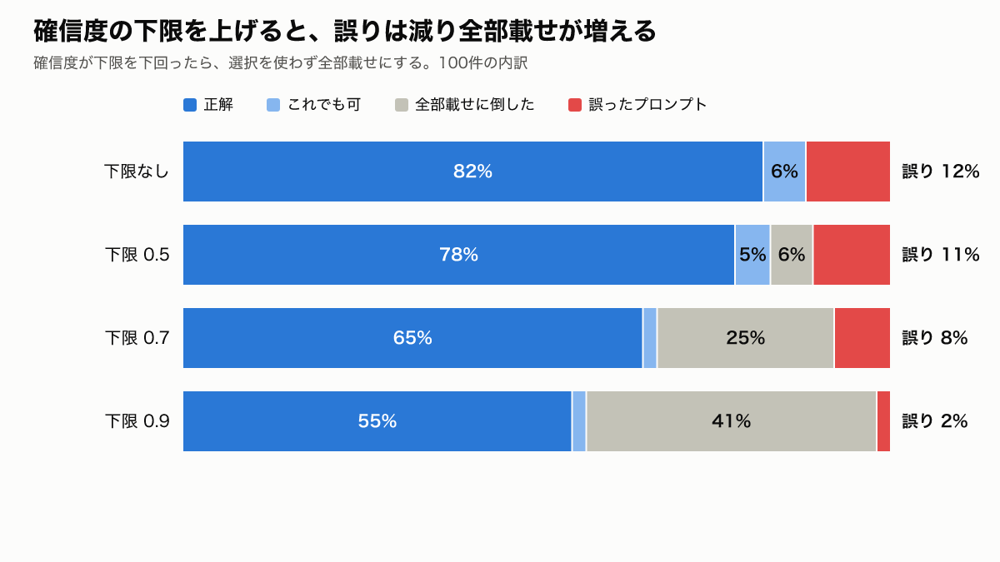

# 結果サマリー: Jev でシステムプロンプトを1つ選ぶ

- 実行: 2026-10-01T02:31:47.770Z / モデル: jev-1.13.0 / 件数: 100
- 候補12個(専用プロンプト11個 + 基本プロンプト)から、Jev の choice で1つ選ぶ
- 正解率 = 正解と一致 /「これでも可」込み = ラベル付けのときに決めた別解も当たりとする / 誤ったプロンプト = どちらでもないものを選んだ
- 確信度の下限: Jev の `confidence` が下限未満なら、選択を使わず全部載せにする
- 判定時間 p50 174ms / p95 225ms、判定の費用 1000回あたり $0.071

## わかったこと

- **choice で12候補から1つ選ぶと、正解率82%(「これでも可」込み88%)。誤ったプロンプトを選んだのは12件。**
- **間違いは「専用の指示がいらない発話」に集中した。** 分野がはっきりした発話(79件)で外したのは2件だけ。
  - 外した12件のうち10件は、「基本プロンプト」(13件中7件)と「範囲外の話題」(8件中3件)の取り違え
  - 例: 「はい」「ほかにもある?」に検索のプロンプトを選び、「ありがとう」「こんにちは」に基本プロンプトを選んだ
- **確信度の下限を上げると誤りは減るが、全部載せが増える。**
  - 下限0.5: 誤り11%・全部載せ6% / 下限0.7: 誤り8%・全部載せ25% / 下限0.9: 誤り2%・全部載せ41%
  - 「はい」(0.96)、「ありがとう」(0.92)のように確信度が高いまま外す件があり、下限だけでは防げない
- **判定は速くて安い。** p50 約175ms・p95 約225ms、1000回で約$0.07。
- **「地名・職種の言い換え」が正解になる発話は0件。** 必ず検索とセットで出てくるので、1つ選ぶ設計なら検索プロンプトに統合するのが自然。

## 言えないこと・データの偏り

- **評価データは合成で、プロンプトを書いた本人が発話もラベルも作っている。** 実際の発話では精度が下がるおそれがある。ラベルの二重チェックもしていない。
- **件数が少ない。** 正解が「範囲外」は8件、「エラー時」は4件しかなく、1件で10ポイント以上動く。
- **「基本プロンプト」の範囲は、今回の設計上の決め(ツール操作・相づち・安全の部品で足りる相談)。** 実際のシステムに合わせて決め直す必要がある。
- **応答の品質は測っていない。** 間違ったプロンプトを渡したとき、回答がどれだけ悪くなるかは未検証。
- 結果は `jev-1.13.0` のもの。

## 結果(choice・日本語)

| 確信度の下限 | 正解率 | 「これでも可」込み | 誤ったプロンプト | 全部載せに倒した |
|---|---:|---:|---:|---:|
| なし | 82% | 88% | 12% | 0% |
| 0.5 | 78% | 83% | 11% | 6% |
| 0.7 | 65% | 67% | 8% | 25% |
| 0.9 | 55% | 57% | 2% | 41% |

## 選び間違えた件(下限なし)

| id | 発話 | 正解 | Jev が選んだ | 確信度 |
|---|---|---|---|---:|
| e010 | (文脈あり) ほかにもある? | 基本プロンプト | **検索条件の聞き出し** | 0.86 |
| e011 | 検索したら0件だった、どうすれば | 検索条件の聞き出し | **エラー時** | 0.74 |
| e060 | こんにちは | 範囲外の話題 | **基本プロンプト** | 0.61 |
| e061 | (文脈あり) ありがとう!助かった | 範囲外の話題 | **基本プロンプト** | 0.92 |
| e062 | 仕事のストレスで最近眠れない | 基本プロンプト | **範囲外の話題** | 0.70 |
| e065 | 荷物受け取るだけで日給3万ってバイトどう思う? | 基本プロンプト | **給与・待遇** | 0.87 |
| e067 | 他の求人サイトとどっちが使いやすい? | 範囲外の話題 | **基本プロンプト** | 0.87 |
| e070 | (文脈あり) はい | 基本プロンプト | **検索条件の聞き出し** | 0.96 |
| e075 | (文脈あり) この求人、未経験でもいける? | 基本プロンプト | **キャリア相談** | 0.37 |
| e076 | (文脈あり) 面接何回あるの? | 基本プロンプト | **面接対策** | 0.56 |
| e078 | (文脈あり) この会社の他の求人も見たい | 基本プロンプト | **検索条件の聞き出し** | 0.62 |
| e087 | 応募したいけどWeb履歴書が埋まってないって出る | 応募書類 | **エラー時** | 0.72 |

**よくある取り違え**

- 基本プロンプト → 検索条件の聞き出し: 3件
- 範囲外の話題 → 基本プロンプト: 3件
- 検索条件の聞き出し → エラー時: 1件
- 基本プロンプト → 範囲外の話題: 1件
- 基本プロンプト → 給与・待遇: 1件
- 基本プロンプト → キャリア相談: 1件

## 補足: ほかの聞き方(下限なし)

- choice(英語の説明): 正解率 83%(可込み 89%)、誤り 11%、判定の入力 1114 tok/回
- noul ×11 の最大値: 正解率 81%(可込み 89%)、誤り 11%、判定の入力 3756 tok/回
