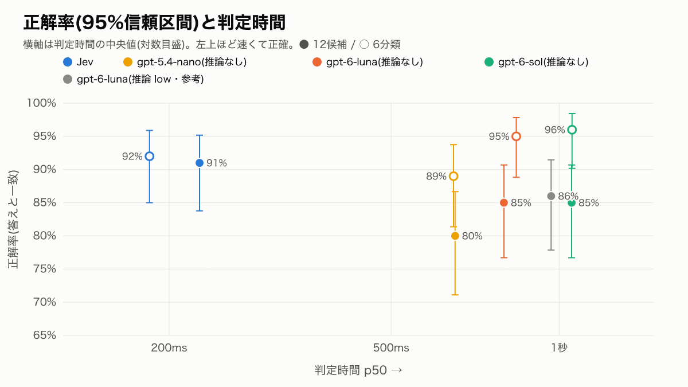
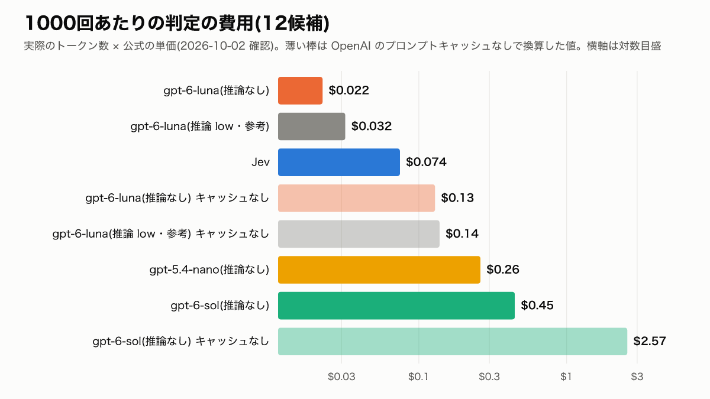
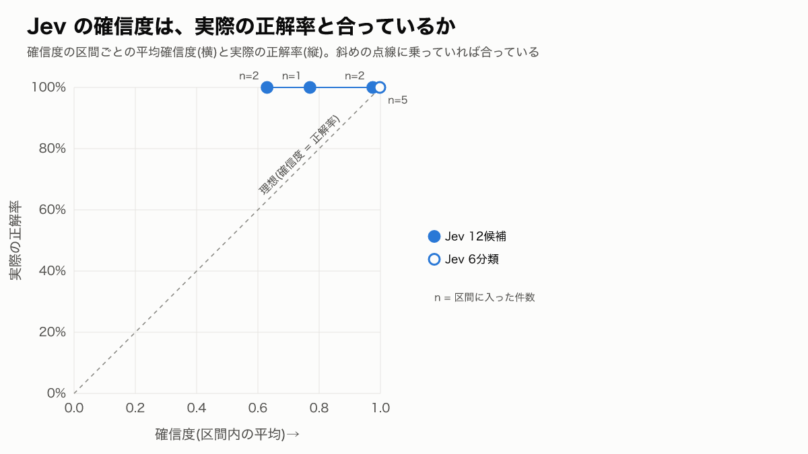

# v2 結果: Jev と LLM 分類器の比較

- 実行: 2026-10-02T12:50:44.219Z / 100件 / darwin-arm64、Node v24.18.0 / 実行費用 $0.166
- 正解データ: `data/eval.v2.jsonl`(基準: `data/LABELING.v2.md`)
- 判定時間: 同じ端末・同じ回線から1件ずつ順番に実行。各件で全構成を交互に呼び、最初の3件は全構成で一度回して捨てた
- 費用: 実際のトークン数 × 公式の単価(`results/v2/PRICING.md`、2026-10-02 確認)
- 選択後のプロンプト: 選ばれた候補の部品を足したトークン数(o200k による近似)。全部載せは 22,653 tok、基本プロンプトは 3,789 tok。6分類は、その分類に含まれる部品をすべて載せる
- API エラーのときは基本プロンプトを使ったものとして採点した

## わかったこと

1. **判定時間は Jev が3〜5倍速い。** Jev は p50 0.18〜0.23秒・p95 0.31〜0.34秒。LLM は p50 0.65〜1.05秒・p95 0.87〜1.87秒。
2. **12候補で答えと一致した割合は Jev が最も高い(91%)。** ただし統計的に差があると言えるのは gpt-5.4-nano(80%)との差だけ(McNemar p=0.007)。
   gpt-6-luna(85%、p=0.18)や gpt-6-sol(85%、p=0.24)との差は、100件では偶然の範囲を出ない。
3. **LLM が答えを外した件の多くは、「検索条件」を正解とした発話で「地名・職種の言い換え」を選んだもの**(sol 11件、luna 7件、nano 4件)。
   言い換えは「これでも可」としているので、別解込みでは Jev 99%・luna 98%・sol 100% とほぼ並ぶ。12候補での Jev の優位は、この境目の決め方に大きく左右される。
4. **6分類にすると LLM が追いつく。** sol 96%・luna 95%・Jev 92%・nano 89%。どの差も有意ではない(p≥0.34)。
5. **推論を足しても正解率はほぼ変わらない。** gpt-6-luna は推論なし 85% → 推論 low 86%。判定時間は p50 が +0.17秒、p95 が 1.03秒 → 1.87秒に延びた。
6. **費用は「Jev が一番安い」とは言えない。** 1000回あたり Jev は $0.074。gpt-6-luna はプロンプトキャッシュが効けば $0.022、毎回キャッシュ切れなら $0.158 で、**ヒット率62%以上なら Jev より安い**。
   キャッシュは最後に使われてから30分有効なので、判定の呼び出しが30分に1回以上ある実際のサービスなら、ヒット率はほぼ100%に近いと考えられる(今回の実行では100%)。
   一方、gpt-6-sol はキャッシュが効いても $0.45 で常に Jev より高い。gpt-5.4-nano はキャッシュに乗らず $0.26 だった。原因はプロンプトが短いこと(約1,200トークン)で、nano がキャッシュする最小の長さ(実測で約1,800〜1,950トークン)に届いていなかった。
7. **Jev の確信度は、実際の正解率より低めに出る(控えめ)。** 確信度0.9以上の67件は正解率96%(平均確信度0.98)。0.7〜0.9の17件は88%(同0.78)、0.5〜0.7の14件は71%(同0.58)。
   確信度0.9以上だけを信用する運用なら、正解率96%で全体の2/3をさばける。
8. **選んだ後に載せるプロンプトは、12候補で平均約5,300トークン、6分類で約8,000トークン。** 全部載せ(約22,700トークン)の約1/4と約1/3。
9. 全構成・全件で API エラーは0件だった。

## 言えないこと・データの偏り

- **正解は Claude Opus 5.5 が付けたラベル。** 元のラベル(作成者1名)との一致は97%(kappa 0.966)で、食い違った3件も確認したうえで採用した。ただし、境目(検索と言い換え、基本と範囲外)の決め方を変えると、12候補の順位は入れ替わりうる(上の3)。
- **データは合成の100件で、作成者がプロンプトも発話も書いている。** 95%信頼区間の幅は ±6〜9ポイントあり、数ポイントの差は判断できない。
- **判定時間は、1台の端末・1つの回線・1回の実行(約25分間)で測った値。** 時間帯や地域、API 側の混み具合で変わる。LLM 側は構造化出力の処理時間も含む。
- **推論ありは gpt-6-luna の low の1段階だけ。** より強い推論や、別のモデルでの効果は測っていない。
- **指示文と候補の説明は1通りだけ。** どの分類器向けにも調整していないが、書き方を変えれば結果は動きうる。
- **選んだプロンプトでの応答の品質は測っていない。**
- gpt-5.4-nano のキャッシュが効く最小の長さは公式ドキュメントに数値がなく、実験で約1,800〜1,950トークンの間と絞っただけ。gpt-6-sol には後継の gpt-6.1-sol があるが、推論なしを選べないため測っていない。

## 構成別の比較

| 構成 | 粒度 | 正解率 [95%CI] | 「これでも可」込み [95%CI] | 判定時間 p50 / p95 | 費用 / 1000回(実績) | 同(毎回キャッシュ切れ) | 選択後のプロンプト(平均) | エラー |
|---|---|---:|---:|---:|---:|---:|---:|---:|
| Jev | 12候補 | 91% [84%–95%] | 99% [95%–100%] | 227ms / 336ms | $0.074 | $0.074 | 5,291 tok | 0 |
| Jev | 6分類 | 92% [85%–96%] | 97% [92%–99%] | 184ms / 314ms | $0.073 | $0.073 | 7,993 tok | 0 |
| gpt-5.4-nano(推論なし) | 12候補 | 80% [71%–87%] | 91% [84%–95%] | 651ms / 869ms | $0.261 | $0.261 | 5,407 tok | 0 |
| gpt-5.4-nano(推論なし) | 6分類 | 89% [81%–94%] | 93% [86%–97%] | 647ms / 872ms | $0.253 | $0.253 | 8,241 tok | 0 |
| gpt-6-luna(推論なし) | 12候補 | 85% [77%–91%] | 98% [93%–99%] | 796ms / 1.03秒 | $0.022 | $0.158 | 5,338 tok | 0 |
| gpt-6-luna(推論なし) | 6分類 | 95% [89%–98%] | 98% [93%–99%] | 838ms / 1.19秒 | $0.021 | $0.153 | 7,949 tok | 0 |
| gpt-6-sol(推論なし) | 12候補 | 85% [77%–91%] | 100% [96%–100%] | 1.05秒 / 1.46秒 | $0.446 | $3.162 | 5,310 tok | 0 |
| gpt-6-sol(推論なし) | 6分類 | 96% [90%–98%] | 98% [93%–99%] | 1.05秒 / 1.41秒 | $0.428 | $3.069 | 7,946 tok | 0 |
| gpt-6-luna(推論 low・参考) | 12候補 | 86% [78%–91%] | 99% [95%–100%] | 968ms / 1.87秒 | $0.032 | $0.168 | 5,319 tok | 0 |

gpt-6-luna(推論 low)の推論トークンは1回あたり平均 17。

## Jev と LLM の差(McNemar の正確検定、同じ100件での勝ち負け)

b = Jev だけ正解、c = 相手だけ正解。p が小さいほど差が偶然ではない。

| 粒度 | 比較 | 採点 | b | c | p |
|---|---|---|---:|---:|---:|
| 12候補 | Jev vs gpt-5.4-nano(推論なし) | 答え | 13 | 2 | 0.007 |
| 12候補 | Jev vs gpt-5.4-nano(推論なし) | これでも可込み | 8 | 0 | 0.008 |
| 12候補 | Jev vs gpt-6-luna(推論なし) | 答え | 10 | 4 | 0.180 |
| 12候補 | Jev vs gpt-6-luna(推論なし) | これでも可込み | 1 | 0 | 1.000 |
| 12候補 | Jev vs gpt-6-sol(推論なし) | 答え | 12 | 6 | 0.238 |
| 12候補 | Jev vs gpt-6-sol(推論なし) | これでも可込み | 0 | 1 | 1.000 |
| 12候補 | Jev vs gpt-6-luna(推論 low・参考) | 答え | 10 | 5 | 0.302 |
| 12候補 | Jev vs gpt-6-luna(推論 low・参考) | これでも可込み | 0 | 0 | 1.000 |
| 6分類 | Jev vs gpt-5.4-nano(推論なし) | 答え | 5 | 2 | 0.453 |
| 6分類 | Jev vs gpt-5.4-nano(推論なし) | これでも可込み | 5 | 1 | 0.219 |
| 6分類 | Jev vs gpt-6-luna(推論なし) | 答え | 1 | 4 | 0.375 |
| 6分類 | Jev vs gpt-6-luna(推論なし) | これでも可込み | 1 | 2 | 1.000 |
| 6分類 | Jev vs gpt-6-sol(推論なし) | 答え | 3 | 7 | 0.344 |
| 6分類 | Jev vs gpt-6-sol(推論なし) | これでも可込み | 2 | 3 | 1.000 |

## Jev の確信度と実際の正解率

| 構成 | 確信度の区間 | 件数 | 平均確信度 | 正解率 | 「これでも可」込み |
|---|---|---:|---:|---:|---:|
| Jev 12候補 | 0.5未満 | 2 | 0.47 | 100% | 100% |
| Jev 12候補 | 0.5〜0.7 | 14 | 0.58 | 71% | 100% |
| Jev 12候補 | 0.7〜0.9 | 17 | 0.78 | 88% | 94% |
| Jev 12候補 | 0.9以上 | 67 | 0.98 | 96% | 100% |
| Jev 6分類 | 0.5未満 | 6 | 0.37 | 50% | 67% |
| Jev 6分類 | 0.5〜0.7 | 2 | 0.61 | 0% | 50% |
| Jev 6分類 | 0.7〜0.9 | 9 | 0.85 | 78% | 100% |
| Jev 6分類 | 0.9以上 | 83 | 0.98 | 99% | 100% |

## 取り違え(「これでも可」でも救えなかったもの、正解 → 選択)

- **Jev 12候補**: 基本 → 給与・待遇 (1)
- **Jev 6分類**: 基本 → 範囲外 (1)、基本 → 情報提供 (1)、相談 → 範囲外 (1)
- **gpt-5.4-nano(推論なし) 12候補**: 基本 → 検索条件 (2)、応募書類 → 基本 (1)、基本 → キャリア相談 (1)、基本 → 範囲外 (1)、基本 → 給与・待遇 (1)、基本 → 面接対策 (1)、基本 → エラー時 (1)、ログイン・規約 → 給与・待遇 (1)
- **gpt-5.4-nano(推論なし) 6分類**: 基本 → 相談 (2)、ハウツー → 情報提供 (2)、基本 → 範囲外 (1)、基本 → ハウツー (1)、基本 → 情報提供 (1)
- **gpt-6-luna(推論なし) 12候補**: 基本 → キャリア相談 (1)、基本 → 給与・待遇 (1)
- **gpt-6-luna(推論なし) 6分類**: 基本 → 範囲外 (1)、基本 → ハウツー (1)
- **gpt-6-sol(推論なし) 12候補**: なし
- **gpt-6-sol(推論なし) 6分類**: 範囲外 → 相談 (1)、基本 → ハウツー (1)
- **gpt-6-luna(推論 low・参考) 12候補**: 基本 → 給与・待遇 (1)

### 6分類の対応表(行 = 正解、列 = 選択)

**Jev**

| 正解 \ 選択 | 相談 | 書類作成 | 情報提供 | ハウツー | 範囲外 | 基本 |
|---|---:|---:|---:|---:|---:|---:|
| 相談 | 28 | 0 | 0 | 1 | 1 | 0 |
| 書類作成 | 0 | 6 | 0 | 1 | 0 | 0 |
| 情報提供 | 0 | 0 | 23 | 0 | 1 | 0 |
| ハウツー | 0 | 0 | 0 | 18 | 0 | 0 |
| 範囲外 | 0 | 0 | 0 | 0 | 6 | 0 |
| 基本 | 2 | 0 | 1 | 0 | 1 | 11 |

**gpt-6-sol(推論なし)**

| 正解 \ 選択 | 相談 | 書類作成 | 情報提供 | ハウツー | 範囲外 | 基本 |
|---|---:|---:|---:|---:|---:|---:|
| 相談 | 28 | 0 | 1 | 1 | 0 | 0 |
| 書類作成 | 0 | 7 | 0 | 0 | 0 | 0 |
| 情報提供 | 0 | 0 | 24 | 0 | 0 | 0 |
| ハウツー | 0 | 0 | 0 | 18 | 0 | 0 |
| 範囲外 | 1 | 0 | 0 | 0 | 5 | 0 |
| 基本 | 0 | 0 | 0 | 1 | 0 | 14 |

## 正解ラベルの作り方

- 元のラベル(作成者1名、v1)と、Claude Opus 5.5 が基準書 v2 だけを見て独立に付けたラベルを突き合わせた
- 件数: 100
- 答えの一致率: **97.0%**(97/100)
- Cohen's kappa(答え、12候補): **0.966**
- 別解まで含めた一致率(どちらかの答えが相手の「答え+これでも可」に入る): 98.0%(98/100)
- 食い違いは主に v2 で決め直した境目(あいさつ・お礼を「範囲外」から「基本」へ)によるもの。確認のうえ、Claude のラベルをそのまま v2 の正解にした(`results/v2/label-review.md`)

## 条件の違い(Jev と LLM)

- 候補の説明文・直前の会話・発話・指示文は同じものを渡した
- Jev は `state`(会話)と choice の質問として、LLM は system に指示と候補一覧、user に会話の JSON として受け取る
- LLM は Chat Completions、構造化出力(候補 id の enum)、`reasoning_effort: none`(参考の1構成だけ low)。gpt-6-sol の後継の gpt-6.1-sol は `none` に対応していないため使っていない
- LLM の system(指示と候補一覧)は全件で同じなので、OpenAI 側の自動プロンプトキャッシュが効いた。入力のうちキャッシュから読まれた割合の平均: gpt-5.4-nano(推論なし) 12候補 0%、gpt-5.4-nano(推論なし) 6分類 0%、gpt-6-luna(推論なし) 12候補 97%、gpt-6-luna(推論なし) 6分類 97%、gpt-6-sol(推論なし) 12候補 97%、gpt-6-sol(推論なし) 6分類 97%、gpt-6-luna(推論 low・参考) 12候補 97%。Jev にはキャッシュの割引がない

## キャッシュの有効期限を考えた費用

OpenAI のプロンプトキャッシュは、GPT-5.6 以降では最後に使われてから30分有効で、書き込みは入力単価の1.25倍、読み出しは0.1倍(https://developers.openai.com/api/docs/guides/prompt-caching 、2026-10-02 確認)。
費用はヒット率で決まるので、両端と、Jev と同じ費用になるヒット率を示す(12候補、1000回あたり)。

| 構成 | 毎回キャッシュが効く | 毎回キャッシュ切れ(書き込み) | Jev と並ぶヒット率 |
|---|---:|---:|---:|
| gpt-5.4-nano(推論なし) | $0.261 | $0.261 | キャッシュされない |
| gpt-6-luna(推論なし) | $0.022 | $0.158 | 62% |
| gpt-6-sol(推論なし) | $0.446 | $3.162 | なし(常に Jev より高い) |
| gpt-6-luna(推論 low・参考) | $0.032 | $0.168 | 69% |

- 今回の実行では、ウォームアップで書き込みが済み、採点した100件はすべてキャッシュに当たった(呼び出し間隔は約15秒)
- 30分の有効期限は使われるたびに延びるので、判定の呼び出しが30分に1回以上ある限り、キャッシュは切れない。ヒット率が下がるのは、呼び出しがまばらな場合や、負荷分散で別のマシンに振られた場合、候補の説明を変えた直後
- gpt-5.4-nano は、同じプロンプトを続けて送ってもキャッシュに乗らなかった。原因はプロンプトの長さ。GPT-5.6 以降はキャッシュされる最小の長さが1,024トークンだが、それより前のモデルは「リクエストの設定で変わる」とだけ書かれている(数値の記載なし)。追加の実験では、nano は約1,800トークンでは乗らず、約1,950トークンで乗った(1,792トークンがキャッシュ)。今回のプロンプトは約1,200トークンなので、nano のキャッシュは効かない。構造化出力の有無、推論の設定、`prompt_cache_key`、保持期間の指定、Responses API は関係なかった
- もしプロンプトを約1,950トークン以上にすれば、nano も1000回あたり約 $0.08 まで下がる見込み(試算)。ただし、そのために説明文を長くすると精度が変わりうるので、今回は測っていない
