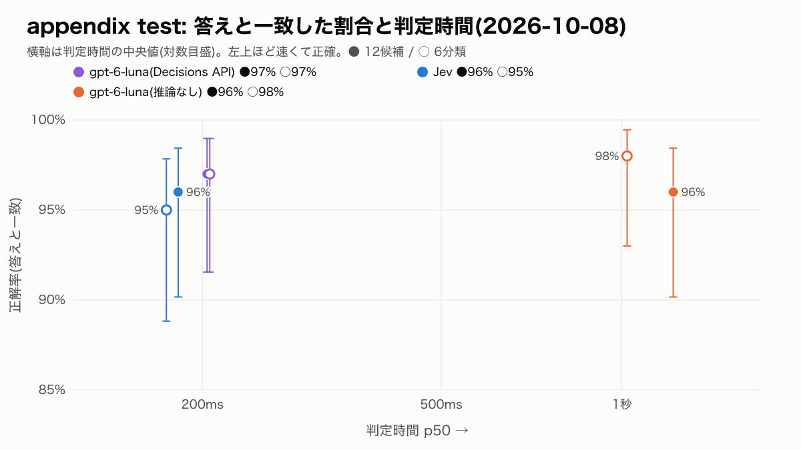

# appendix: OpenAI Decisions API の追加測定

- 計画: [PLAN.md](PLAN.md)。v3 本編([../summary.md](../summary.md))の結果と結論は変えない
- 条件: v3 で凍結した指示文・説明文・test・dev。手順も本編と同じ(1回ずつ順番、各件で順番をランダム、リトライ0回、ウォームアップは専用の3発話)。OpenAI の Node SDK は 7.30.0(本編は 7.27.0)
- 判定時間は、この実行の中の構成どうしで比べる(本編とは測った日が違う)
- 単価: Decisions API は入力 $0.10 / 1M のみ(出力・キャッシュは課金なし。https://developers.openai.com/api/docs/guides/decisions 、2026-10-08 確認)。ほかは [../PRICING.md](../PRICING.md)

## わかったこと

主な結論は test(100件)の数字で言う。dev は参考。判定時間と費用は、すべて同じ実行(2026-10-08)の中の数字。

1. **正解率は、Decisions API と Jev で差があるとは言えない。** test で答えと一致した割合は、12候補で Decisions 97%・Jev 96%、6分類で Decisions 97%・Jev 95%。Holm 補正後の p はどちらも 1.000。片方だけが正解した件は、12候補で7件、6分類で4件しかない
2. **Decisions API の判定時間は Jev に近い。** test の p50 は Decisions 0.20〜0.21秒・Jev 0.17〜0.18秒、p95 は Decisions 0.34〜0.35秒・Jev 0.23〜0.29秒。同じ実行の gpt-6-luna(Chat、推論なし)は p50 1.02〜1.22秒・p95 1.72〜1.88秒で、**同じモデルでも Decisions API は Chat の約5〜6分の1の時間**だった。Jev との差は p50 で約0.03秒で、この差に意味があるかは検定していない
3. **費用は Jev のほうが安い。** 1000回あたり、12候補で Decisions $0.145・Jev $0.086、6分類で Decisions $0.115・Jev $0.069(約1.7倍)。1回あたりの入力トークンは Jev のほうが多い(12候補で 2,049 対 1,450)が、単価が Decisions の約0.42倍($0.042 対 $0.10 / 1M)。gpt-6-luna(Chat)はキャッシュが効いて $0.028 で、3つの中で一番安い
4. **確信度0.9以上の件は、Decisions API でも全件正解だった。** test の12候補で、Decisions は77件・Jev は83件が0.9以上で、どちらも答えと一致した割合は100%
5. **呼び直しても、Jev はほぼ同じ候補を選んだ。** v3 本編(2026-10-04)と比べて、選んだ候補が違った件は、test で0件、dev で1件(12候補・6分類の合計)。gpt-6-luna(Chat)は test で5件、dev で4件違い、test の12候補は本編の98%から96%になった
6. 全構成・全件(test・dev 各600回)で、失敗した呼び出しは0件だった。費用は test・dev 合わせて $0.096

## test(主)

- 実行: 2026-10-08T01:52:02.223Z 開始、100件 × 6構成、費用 $0.048(`raw/run-test-2026-10-08T01-52-02-n100.json`)。凍結した入力のハッシュは実行の前後で一致

| 構成 | 粒度 | 返ってきたモデル名 | 答えと一致 [95%CI] | 別解込み | 判定時間 p50 / p95 | 費用 / 1000回 | 入力トークン / 回 | 失敗 |
|---|---|---|---:|---:|---:|---:|---:|---:|
| gpt-6-luna(Decisions API) | 12候補 | `gpt-6-luna` | 97% [92%–99%] | 100% | 0.20秒 / 0.35秒 | $0.145 | 1,450 | 0 |
| gpt-6-luna(Decisions API) | 6分類 | `gpt-6-luna` | 97% [92%–99%] | 100% | 0.21秒 / 0.34秒 | $0.115 | 1,152 | 0 |
| Jev | 12候補 | `jev-1.13.0` | 96% [90%–98%] | 98% | 0.18秒 / 0.23秒 | $0.086 | 2,049 | 0 |
| Jev | 6分類 | `jev-1.13.0` | 95% [89%–98%] | 98% | 0.17秒 / 0.29秒 | $0.069 | 1,647 | 0 |
| gpt-6-luna(推論なし) | 12候補 | `gpt-6-luna` | 96% [90%–98%] | 100% | 1.22秒 / 1.88秒 | $0.028 | 1,442 | 0 |
| gpt-6-luna(推論なし) | 6分類 | `gpt-6-luna` | 98% [93%–99%] | 100% | 1.02秒 / 1.72秒 | $0.024 | 1,123 | 0 |

### Decisions API との差(McNemar の正確検定、答えと一致)

主な比較は Jev との2組(Holm 補正)。gpt-6-luna(Chat)との比較は参考。

| 粒度 | 比較 | b(Decisions だけ正解) | c(相手だけ正解) | p | Holm 補正後の p | 判定 |
|---|---|---:|---:|---:|---:|---|
| 12候補 | Decisions 対 Jev | 4 | 3 | 1.000 | 1.000 | 差があるとは言えない |
| 12候補 | Decisions 対 gpt-6-luna(推論なし) | 3 | 2 | 1.000 | - | (参考) |
| 6分類 | Decisions 対 Jev | 3 | 1 | 0.625 | 1.000 | 差があるとは言えない |
| 6分類 | Decisions 対 gpt-6-luna(推論なし) | 0 | 1 | 1.000 | - | (参考) |

### 確信度の区間ごとの正解率(test)

| 構成 | 区間 | 件数 | 平均確信度 | 答えと一致 |
|---|---|---:|---:|---:|
| gpt-6-luna(Decisions API) 12候補 | 0.5未満 | 4 | 0.46 | 75% |
| gpt-6-luna(Decisions API) 12候補 | 0.5〜0.7 | 7 | 0.61 | 86% |
| gpt-6-luna(Decisions API) 12候補 | 0.7〜0.9 | 12 | 0.83 | 92% |
| gpt-6-luna(Decisions API) 12候補 | 0.9以上 | 77 | 0.97 | 100% |
| gpt-6-luna(Decisions API) 6分類 | 0.5未満 | 2 | 0.33 | 100% |
| gpt-6-luna(Decisions API) 6分類 | 0.5〜0.7 | 4 | 0.54 | 75% |
| gpt-6-luna(Decisions API) 6分類 | 0.7〜0.9 | 13 | 0.80 | 92% |
| gpt-6-luna(Decisions API) 6分類 | 0.9以上 | 81 | 0.99 | 99% |
| Jev 12候補 | 0.5未満 | 1 | 0.36 | 0% |
| Jev 12候補 | 0.5〜0.7 | 8 | 0.66 | 75% |
| Jev 12候補 | 0.7〜0.9 | 8 | 0.81 | 88% |
| Jev 12候補 | 0.9以上 | 83 | 0.99 | 100% |
| Jev 6分類 | 0.5未満 | 4 | 0.42 | 75% |
| Jev 6分類 | 0.5〜0.7 | 6 | 0.60 | 50% |
| Jev 6分類 | 0.7〜0.9 | 13 | 0.83 | 100% |
| Jev 6分類 | 0.9以上 | 77 | 0.99 | 99% |

### 呼び直した Jev・gpt-6-luna(Chat)と、v3 本編(2026-10-04)の違い(test)

| 構成 | 粒度 | 本編の答えと一致 | この実行の答えと一致 | 選んだ候補が本編と違った件数 |
|---|---|---:|---:|---:|
| Jev | 12候補 | 96% | 96% | 0 |
| Jev | 6分類 | 95% | 95% | 0 |
| gpt-6-luna(推論なし) | 12候補 | 98% | 96% | 4 |
| gpt-6-luna(推論なし) | 6分類 | 97% | 98% | 1 |

## dev(参考)

- 実行: 2026-10-08T01:57:33.736Z 開始、100件 × 6構成、費用 $0.048(`raw/run-dev-2026-10-08T01-57-33-n100.json`)。凍結した入力のハッシュは実行の前後で一致

| 構成 | 粒度 | 返ってきたモデル名 | 答えと一致 [95%CI] | 別解込み | 判定時間 p50 / p95 | 費用 / 1000回 | 入力トークン / 回 | 失敗 |
|---|---|---|---:|---:|---:|---:|---:|---:|
| gpt-6-luna(Decisions API) | 12候補 | `gpt-6-luna` | 94% [88%–97%] | 99% | 0.21秒 / 0.37秒 | $0.144 | 1,442 | 0 |
| gpt-6-luna(Decisions API) | 6分類 | `gpt-6-luna` | 91% [84%–95%] | 97% | 0.21秒 / 0.36秒 | $0.114 | 1,144 | 0 |
| Jev | 12候補 | `jev-1.13.0` | 91% [84%–95%] | 98% | 0.19秒 / 0.26秒 | $0.086 | 2,037 | 0 |
| Jev | 6分類 | `jev-1.13.0` | 91% [84%–95%] | 96% | 0.18秒 / 0.36秒 | $0.069 | 1,635 | 0 |
| gpt-6-luna(推論なし) | 12候補 | `gpt-6-luna` | 91% [84%–95%] | 95% | 1.30秒 / 1.97秒 | $0.026 | 1,434 | 0 |
| gpt-6-luna(推論なし) | 6分類 | `gpt-6-luna` | 95% [89%–98%] | 99% | 1.02秒 / 1.84秒 | $0.023 | 1,115 | 0 |

### Decisions API との差(McNemar の正確検定、答えと一致)

主な比較は Jev との2組(Holm 補正)。gpt-6-luna(Chat)との比較は参考。

| 粒度 | 比較 | b(Decisions だけ正解) | c(相手だけ正解) | p | Holm 補正後の p | 判定 |
|---|---|---:|---:|---:|---:|---|
| 12候補 | Decisions 対 Jev | 6 | 3 | 0.508 | 1.000 | 差があるとは言えない |
| 12候補 | Decisions 対 gpt-6-luna(推論なし) | 5 | 2 | 0.453 | - | (参考) |
| 6分類 | Decisions 対 Jev | 3 | 3 | 1.000 | 1.000 | 差があるとは言えない |
| 6分類 | Decisions 対 gpt-6-luna(推論なし) | 2 | 6 | 0.289 | - | (参考) |

### 確信度の区間ごとの正解率(dev)

| 構成 | 区間 | 件数 | 平均確信度 | 答えと一致 |
|---|---|---:|---:|---:|
| gpt-6-luna(Decisions API) 12候補 | 0.5未満 | 6 | 0.38 | 50% |
| gpt-6-luna(Decisions API) 12候補 | 0.5〜0.7 | 8 | 0.56 | 63% |
| gpt-6-luna(Decisions API) 12候補 | 0.7〜0.9 | 19 | 0.82 | 100% |
| gpt-6-luna(Decisions API) 12候補 | 0.9以上 | 67 | 0.97 | 100% |
| gpt-6-luna(Decisions API) 6分類 | 0.5未満 | 7 | 0.42 | 43% |
| gpt-6-luna(Decisions API) 6分類 | 0.5〜0.7 | 6 | 0.61 | 67% |
| gpt-6-luna(Decisions API) 6分類 | 0.7〜0.9 | 7 | 0.83 | 71% |
| gpt-6-luna(Decisions API) 6分類 | 0.9以上 | 80 | 0.99 | 99% |
| Jev 12候補 | 0.5未満 | 8 | 0.44 | 38% |
| Jev 12候補 | 0.5〜0.7 | 5 | 0.58 | 60% |
| Jev 12候補 | 0.7〜0.9 | 12 | 0.85 | 83% |
| Jev 12候補 | 0.9以上 | 75 | 0.99 | 100% |
| Jev 6分類 | 0.5未満 | 4 | 0.42 | 25% |
| Jev 6分類 | 0.5〜0.7 | 8 | 0.58 | 63% |
| Jev 6分類 | 0.7〜0.9 | 15 | 0.81 | 80% |
| Jev 6分類 | 0.9以上 | 73 | 0.99 | 100% |

### 呼び直した Jev・gpt-6-luna(Chat)と、v3 本編(2026-10-04)の違い(dev)

| 構成 | 粒度 | 本編の答えと一致 | この実行の答えと一致 | 選んだ候補が本編と違った件数 |
|---|---|---:|---:|---:|
| Jev | 12候補 | 90% | 91% | 1 |
| Jev | 6分類 | 91% | 91% | 0 |
| gpt-6-luna(推論なし) | 12候補 | 92% | 91% | 1 |
| gpt-6-luna(推論なし) | 6分類 | 94% | 95% | 3 |

## 言えないこと

- Decisions API は2026-10-08時点でパブリックベータ。精度・速さ・料金は今後変わりうる。使えるモデルは gpt-6-luna だけ
- 判定時間は1台の端末から1回の実行で測ったもの。gpt-6-luna(Chat)の判定時間は本編(2026-10-04)と大きく違い、日や時間帯で変わる
- v3 本編の「言えないこと」はすべてこちらにも当てはまる。とくに test は易しく(発話が長く、狙った分類と正解が100件すべて一致)、正解率の差を判断するには件数が足りない
- Decisions API には会話の JSON を文字列で渡した。メッセージ形式で渡すなど、別の渡し方では結果が変わりうる
