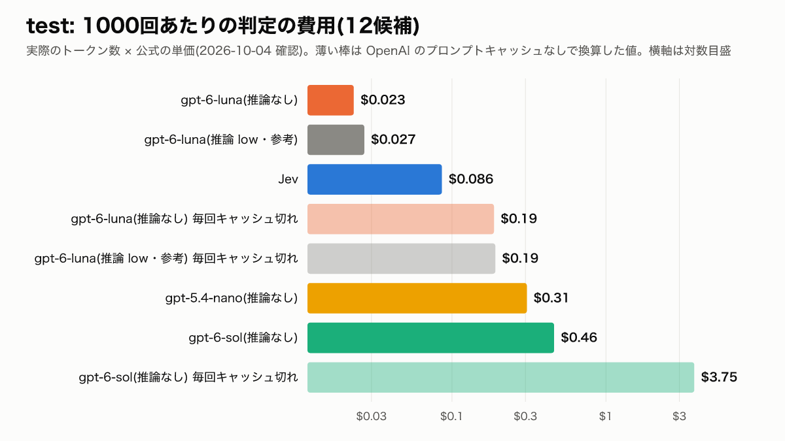
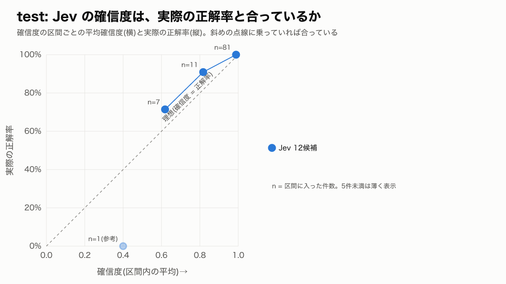

# v3 結果: Jev と LLM 分類器の比較

- 計画: [PLAN.md](PLAN.md)(2026-10-04 承認、ハッシュは [FROZEN.md](FROZEN.md))。計画から変えた点: なし
- test: 2026-10-04T13:18:05.329Z 開始、100件 × 9構成、実行費用 $0.167(`raw/run-test-2026-10-04T13-18-05-n100.json`)
- dev: 2026-10-04T13:30:00.588Z 開始、100件 × 9構成、実行費用 $0.182(`raw/run-dev-2026-10-04T13-30-00-n100.json`)
- 端末: darwin-arm64、Node v24.18.0。1回ずつ順番に呼び、各件で9構成の順番をランダムに並べ替えた(種 20261004)。自動リトライ0回。ウォームアップは dev・test にない3発話
- 凍結した入力のハッシュは、test・dev とも実行の前と後で一致した
- test の1回目の実行は、実行環境(Claude Code のコマンドの時間制限10分)で途中で止められ、結果を書き出す前に終わった。結果は保存されず、誰も見ていない。PLAN 8章のとおり test を最初から全部やり直した。1回目の費用は記録が残っていないが、2回目の実績から $0.17 以下と見込む
- 失敗した呼び出しは不正解として採点した

## わかったこと

主な結論は test(100件)の数字で言う。dev は参考。

1. **test では、Jev と各 LLM の正解率に、差があるとは言えない。** 主な比較の6組(12候補・6分類 × gpt-5.4-nano・gpt-6-luna・gpt-6-sol)は、どれも Holm 補正後の p が 1.000 だった(補正前でも p ≥ 0.375)。
   - 12候補で答えと一致した割合: Jev 96%、gpt-5.4-nano 94%、gpt-6-luna 98%、gpt-6-sol 99%
   - 6分類: Jev 95%、gpt-5.4-nano 93%、gpt-6-luna 97%、gpt-6-sol 97%
   - どの組も、片方だけが正解した件は合わせて8件以下(b + c ≤ 8)だった。差を判断するには件数が足りない
   - これは「差がない」ことを示すものではない
2. **test は易しかった。** 9構成すべてが、答えと一致した割合で93〜99%だった。別解込みでは、Jev 98%、LLM は 96〜100%。別解でも救えなかった取り違えは、範囲外と基本の境目に集中した(Jev 12候補は、範囲外 → 基本と、基本 → 検索条件の各1件)
3. **判定時間は Jev が短い。** test の p50 は Jev 0.19〜0.20秒、LLM 0.69〜0.96秒(約3.5〜5倍)。p95 は Jev 0.24〜0.29秒、LLM 0.88〜1.84秒。dev でも同じ傾向だった。どの呼び出し順でも、この関係は変わらなかった(「呼び出しの順番と判定時間」の表)。1台の端末・1回の実行で測った値
4. **費用は「Jev が一番安い」とは言えない。** test の1000回あたりの費用(12候補)は、Jev $0.086、gpt-6-luna はキャッシュが効いて $0.023(毎回キャッシュ切れなら $0.187)。gpt-6-luna は、キャッシュのヒット率が62%以上なら Jev より安い。gpt-6-sol は $0.461 で常に Jev より高い。gpt-5.4-nano はキャッシュに乗らず $0.307 だった
5. **Jev は、1回あたりの入力トークンが LLM より多い。** 12候補で Jev 2,049、LLM 1,442(test の平均)。6分類でも Jev 1,647、LLM 1,123。単価が低いので、費用は gpt-6-luna(推論なし・推論 low とも、キャッシュが効いた場合)を除いて LLM より安い
6. **Jev の確信度0.9以上の件は、test では全件正解だった。** 12候補で81件が0.9以上で、答えと一致した割合は100%。0.9未満の19件は、答えと一致した割合が79%(15件)。dev でも0.9以上の76件は100%、0.9未満の24件は58%(14件)。選んだ候補の確率で区切っても、ほぼ同じ結果だった
7. **推論 low を足しても、test の正解率はほとんど変わらなかった。** gpt-6-luna は推論なし 98% → 推論 low 99%。p95 は 1.42秒 → 1.84秒に延びた。推論トークンは test で100回中75回が0だった
8. **dev では、v2 から v3 で LLM の12候補の正解率が上がり、Jev は上がらなかった。** v2 の正解で採点した場合は、gpt-6-sol 85% → 94%、gpt-6-luna 85% → 91%、gpt-5.4-nano 80% → 83%、Jev 91% → 87%。説明文・指示文・呼ぶ順番・リトライ・ウォームアップを同時に変えたので、どれが効いたかは分けられない。v2 では「12候補の正解率は Jev が最も高い」と書いたが、v3 の dev では Jev 90%、gpt-6-sol 96% で、この順位は成り立たない(この差も Holm 補正後 p = 0.656 で、差があるとは言えない)
9. 全構成・全件(test・dev 各900回)で、失敗した呼び出しは0件だった

## test の比較(主)

| 構成 | 粒度 | 返ってきたモデル名 | 答えと一致 [95%CI] | 別解込み [95%CI] | 判定時間 p50 / p95 | 費用 / 1000回(実績) | 同(毎回キャッシュ切れ) | 失敗 |
|---|---|---|---:|---:|---:|---:|---:|---:|
| Jev | 12候補 | `jev-1.13.0` | 96% [90%–98%] | 98% [93%–99%] | 0.20秒 / 0.29秒 | $0.086 | $0.086 | 0 |
| Jev | 6分類 | `jev-1.13.0` | 95% [89%–98%] | 98% [93%–99%] | 0.19秒 / 0.24秒 | $0.069 | $0.069 | 0 |
| gpt-5.4-nano(推論なし) | 12候補 | `gpt-5.4-nano-2026-03-17` | 94% [88%–97%] | 98% [93%–99%] | 0.72秒 / 0.91秒 | $0.307 | $0.307 | 0 |
| gpt-5.4-nano(推論なし) | 6分類 | `gpt-5.4-nano-2026-03-17` | 93% [86%–97%] | 96% [90%–98%] | 0.69秒 / 0.88秒 | $0.241 | $0.241 | 0 |
| gpt-6-luna(推論なし) | 12候補 | `gpt-6-luna` | 98% [93%–99%] | 100% [96%–100%] | 0.86秒 / 1.42秒 | $0.023 | $0.187 | 0 |
| gpt-6-luna(推論なし) | 6分類 | `gpt-6-luna` | 97% [92%–99%] | 100% [96%–100%] | 0.88秒 / 1.24秒 | $0.019 | $0.147 | 0 |
| gpt-6-sol(推論なし) | 12候補 | `gpt-6-sol` | 99% [95%–100%] | 100% [96%–100%] | 0.96秒 / 1.32秒 | $0.461 | $3.749 | 0 |
| gpt-6-sol(推論なし) | 6分類 | `gpt-6-sol` | 97% [92%–99%] | 100% [96%–100%] | 0.93秒 / 1.21秒 | $0.387 | $2.941 | 0 |
| gpt-6-luna(推論 low・参考) | 12候補 | `gpt-6-luna` | 99% [95%–100%] | 100% [96%–100%] | 0.92秒 / 1.84秒 | $0.027 | $0.191 | 0 |

- **gpt-6-luna と gpt-6-sol は、日付つきのモデル名(スナップショット名)を返さなかった。** 上の表のモデル名は API の応答の `model` そのまま
- 失敗を除いた正解率は `metrics.json` の `accuracyExcludingFailures`(失敗が0件の構成では同じ値)
- gpt-6-luna 推論 low の推論トークン(12候補): test: 推論トークンが0だった呼び出し 75 / 100回、平均 6.3 トークン。dev: 推論トークンが0だった呼び出し 71 / 100回、平均 13.9 トークン

### Jev と各 LLM の差(McNemar の正確検定、test)

主な比較の6組。Holm 補正後の p が 0.05 未満の組だけを「差がある」とする。「差があるとは言えない」は「差がない」ではない。

| 粒度 | 比較 | 採点 | b(Jevだけ正解) | c(相手だけ正解) | p | Holm 補正後の p | 判定 |
|---|---|---|---:|---:|---:|---:|---|
| 12候補 | Jev 対 gpt-5.4-nano(推論なし) | 答え | 5 | 3 | 0.727 | 1.000 | 差があるとは言えない |
| 12候補 | Jev 対 gpt-6-luna(推論なし) | 答え | 2 | 4 | 0.688 | 1.000 | 差があるとは言えない |
| 12候補 | Jev 対 gpt-6-sol(推論なし) | 答え | 1 | 4 | 0.375 | 1.000 | 差があるとは言えない |
| 6分類 | Jev 対 gpt-5.4-nano(推論なし) | 答え | 4 | 2 | 0.688 | 1.000 | 差があるとは言えない |
| 6分類 | Jev 対 gpt-6-luna(推論なし) | 答え | 2 | 4 | 0.688 | 1.000 | 差があるとは言えない |
| 6分類 | Jev 対 gpt-6-sol(推論なし) | 答え | 1 | 3 | 0.625 | 1.000 | 差があるとは言えない |

参考(別解込みの採点と、推論 low との比較。Holm の補正に含めない):

| 粒度 | 比較 | 採点 | b(Jevだけ正解) | c(相手だけ正解) | p | Holm 補正後の p | 判定 |
|---|---|---|---:|---:|---:|---:|---|
| 12候補 | Jev 対 gpt-5.4-nano(推論なし) | 別解込み | 2 | 2 | 1.000 | - | (参考) |
| 12候補 | Jev 対 gpt-6-luna(推論なし) | 別解込み | 0 | 2 | 0.500 | - | (参考) |
| 12候補 | Jev 対 gpt-6-sol(推論なし) | 別解込み | 0 | 2 | 0.500 | - | (参考) |
| 12候補 | Jev 対 gpt-6-luna(推論 low・参考) | 答え | 1 | 4 | 0.375 | - | (参考) |
| 12候補 | Jev 対 gpt-6-luna(推論 low・参考) | 別解込み | 0 | 2 | 0.500 | - | (参考) |
| 6分類 | Jev 対 gpt-5.4-nano(推論なし) | 別解込み | 2 | 0 | 0.500 | - | (参考) |
| 6分類 | Jev 対 gpt-6-luna(推論なし) | 別解込み | 0 | 2 | 0.500 | - | (参考) |
| 6分類 | Jev 対 gpt-6-sol(推論なし) | 別解込み | 0 | 2 | 0.500 | - | (参考) |

### 費用(test)

| 構成 | 粒度 | 実績 | 毎回キャッシュ切れ | Jev と並ぶヒット率 |
|---|---|---:|---:|---:|
| gpt-5.4-nano(推論なし) | 12候補 | $0.307 | $0.307 | キャッシュされない |
| gpt-5.4-nano(推論なし) | 6分類 | $0.241 | $0.241 | キャッシュされない |
| gpt-6-luna(推論なし) | 12候補 | $0.023 | $0.187 | 62% |
| gpt-6-luna(推論なし) | 6分類 | $0.019 | $0.147 | 61% |
| gpt-6-sol(推論なし) | 12候補 | $0.461 | $3.749 | なし(常に Jev より高い) |
| gpt-6-sol(推論なし) | 6分類 | $0.387 | $2.941 | なし(常に Jev より高い) |
| gpt-6-luna(推論 low・参考) | 12候補 | $0.027 | $0.191 | 64% |

**Jev は、1回あたりの入力トークンが LLM より多い。** Jev は単価が低い($0.042 / 1M)ので費用は安いが、トークン数では多い。

| 構成 | 粒度 | 入力トークン / 回(平均) | うちキャッシュから読まれた割合 |
|---|---|---:|---:|
| Jev | 12候補 | 2,049 | -(キャッシュの割引なし) |
| Jev | 6分類 | 1,647 | -(キャッシュの割引なし) |
| gpt-5.4-nano(推論なし) | 12候補 | 1,442 | 0% |
| gpt-5.4-nano(推論なし) | 6分類 | 1,123 | 0% |
| gpt-6-luna(推論なし) | 12候補 | 1,442 | 99% |
| gpt-6-luna(推論なし) | 6分類 | 1,123 | 99% |
| gpt-6-sol(推論なし) | 12候補 | 1,442 | 99% |
| gpt-6-sol(推論なし) | 6分類 | 1,123 | 99% |
| gpt-6-luna(推論 low・参考) | 12候補 | 1,442 | 99% |

- OpenAI の「毎回キャッシュ切れ」は、キャッシュから読まれた分も書き込みの単価(GPT-6 は入力の1.25倍、gpt-5.4-nano は書き込み単価の記載がないので入力単価)で払ったとした値
- gpt-6 の2モデルは、指示文と候補一覧の部分が毎回キャッシュから読まれ、発話の部分は毎回「キャッシュ書き込み」として返ってきた。費用は返ってきた内訳どおりに計算した。gpt-5.4-nano はキャッシュに乗らなかった
- 単価: [PRICING.md](PRICING.md)(2026-10-04 確認)

## dev の比較(参考)

dev は、step 1 で説明文を直すときに v2 の dev での外れを見ているので、test より高く出やすい。

| 構成 | 粒度 | 返ってきたモデル名 | 答えと一致 [95%CI] | 別解込み [95%CI] | 判定時間 p50 / p95 | 費用 / 1000回(実績) | 同(毎回キャッシュ切れ) | 失敗 |
|---|---|---|---:|---:|---:|---:|---:|---:|
| Jev | 12候補 | `jev-1.13.0` | 90% [83%–94%] | 97% [92%–99%] | 0.19秒 / 0.31秒 | $0.086 | $0.086 | 0 |
| Jev | 6分類 | `jev-1.13.0` | 91% [84%–95%] | 96% [90%–98%] | 0.18秒 / 0.25秒 | $0.069 | $0.069 | 0 |
| gpt-5.4-nano(推論なし) | 12候補 | `gpt-5.4-nano-2026-03-17` | 88% [80%–93%] | 96% [90%–98%] | 0.75秒 / 0.89秒 | $0.305 | $0.305 | 0 |
| gpt-5.4-nano(推論なし) | 6分類 | `gpt-5.4-nano-2026-03-17` | 93% [86%–97%] | 96% [90%–98%] | 0.72秒 / 0.99秒 | $0.240 | $0.240 | 0 |
| gpt-6-luna(推論なし) | 12候補 | `gpt-6-luna` | 92% [85%–96%] | 96% [90%–98%] | 0.91秒 / 1.33秒 | $0.027 | $0.186 | 0 |
| gpt-6-luna(推論なし) | 6分類 | `gpt-6-luna` | 94% [88%–97%] | 98% [93%–99%] | 0.84秒 / 1.15秒 | $0.023 | $0.146 | 0 |
| gpt-6-sol(推論なし) | 12候補 | `gpt-6-sol` | 96% [90%–98%] | 99% [95%–100%] | 0.95秒 / 1.37秒 | $0.532 | $3.726 | 0 |
| gpt-6-sol(推論なし) | 6分類 | `gpt-6-sol` | 95% [89%–98%] | 100% [96%–100%] | 0.95秒 / 1.23秒 | $0.457 | $2.918 | 0 |
| gpt-6-luna(推論 low・参考) | 12候補 | `gpt-6-luna` | 95% [89%–98%] | 98% [93%–99%] | 0.97秒 / 2.04秒 | $0.034 | $0.194 | 0 |

| 粒度 | 比較 | 採点 | b(Jevだけ正解) | c(相手だけ正解) | p | Holm 補正後の p | 判定 |
|---|---|---|---:|---:|---:|---:|---|
| 12候補 | Jev 対 gpt-5.4-nano(推論なし) | 答え | 7 | 5 | 0.774 | 1.000 | 差があるとは言えない |
| 12候補 | Jev 対 gpt-6-luna(推論なし) | 答え | 5 | 7 | 0.774 | 1.000 | 差があるとは言えない |
| 12候補 | Jev 対 gpt-6-sol(推論なし) | 答え | 2 | 8 | 0.109 | 0.656 | 差があるとは言えない |
| 6分類 | Jev 対 gpt-5.4-nano(推論なし) | 答え | 4 | 6 | 0.754 | 1.000 | 差があるとは言えない |
| 6分類 | Jev 対 gpt-6-luna(推論なし) | 答え | 3 | 6 | 0.508 | 1.000 | 差があるとは言えない |
| 6分類 | Jev 対 gpt-6-sol(推論なし) | 答え | 2 | 6 | 0.289 | 1.000 | 差があるとは言えない |

## v2 から v3 で変わった点と、数字の動き(dev)

| | v2 | v3 |
|---|---|---|
| 説明文・指示文 | プロンプト部品の frontmatter から作った | 基準書と同じ範囲・境目で書き直し、凍結(`data/candidates.v3.json`) |
| 正解 | 基準書 v2 によるラベル | 基準書 v3 によるラベル(7件変わった) |
| 呼ぶ順番 | 各件で Jev 12候補が最初 | 各件でランダム |
| 自動リトライ | SDK の既定(最大2回) | 0回 |
| ウォームアップ | 評価セットの最初の3件 | dev・test にない3発話 |
| 失敗の採点 | 基本プロンプトとして採点 | 不正解 |

答えと一致した割合(dev、100件なので件数 = %):

| 構成 | 粒度 | v2(v2 の正解で採点) | v3 の選択を v2 の正解で採点 | v3(v3 の正解で採点) |
|---|---|---:|---:|---:|
| Jev | 12候補 | 91% | 87% | 90% |
| Jev | 6分類 | 92% | 92% | 91% |
| gpt-5.4-nano(推論なし) | 12候補 | 80% | 83% | 88% |
| gpt-5.4-nano(推論なし) | 6分類 | 89% | 90% | 93% |
| gpt-6-luna(推論なし) | 12候補 | 85% | 91% | 92% |
| gpt-6-luna(推論なし) | 6分類 | 95% | 95% | 94% |
| gpt-6-sol(推論なし) | 12候補 | 85% | 94% | 96% |
| gpt-6-sol(推論なし) | 6分類 | 96% | 96% | 95% |
| gpt-6-luna(推論 low・参考) | 12候補 | 86% | 92% | 95% |

- 1列目と2列目の差は、同じ v2 の正解で採点したときの v2 → v3 の動き。説明文・指示文・順番・リトライ・ウォームアップの変更が混ざっていて、どれが効いたかは分けられない
- 2列目と3列目の差は、正解を v3 に変えたことによる動き(選択は同じ)

## Jev の確信度と正解率

主: Jev が返す `confidence`。

**test**

| 構成 | 区間 | 件数 | 平均確信度 | 答えと一致 | 別解込み |
|---|---|---:|---:|---:|---:|
| Jev 12候補 | 0.5未満 | 1 | 0.40 | 0% | 0% |
| Jev 12候補 | 0.5〜0.7 | 7 | 0.62 | 71% | 86% |
| Jev 12候補 | 0.7〜0.9 | 11 | 0.82 | 91% | 100% |
| Jev 12候補 | 0.9以上 | 81 | 0.99 | 100% | 100% |
| Jev 6分類 | 0.5未満 | 3 | 0.40 | 67% | 67% |
| Jev 6分類 | 0.5〜0.7 | 6 | 0.55 | 50% | 83% |
| Jev 6分類 | 0.7〜0.9 | 12 | 0.81 | 100% | 100% |
| Jev 6分類 | 0.9以上 | 79 | 0.98 | 99% | 100% |

**dev**

| 構成 | 区間 | 件数 | 平均確信度 | 答えと一致 | 別解込み |
|---|---|---:|---:|---:|---:|
| Jev 12候補 | 0.5未満 | 8 | 0.43 | 25% | 75% |
| Jev 12候補 | 0.5〜0.7 | 5 | 0.58 | 60% | 100% |
| Jev 12候補 | 0.7〜0.9 | 11 | 0.85 | 82% | 91% |
| Jev 12候補 | 0.9以上 | 76 | 0.99 | 100% | 100% |
| Jev 6分類 | 0.5未満 | 4 | 0.42 | 25% | 25% |
| Jev 6分類 | 0.5〜0.7 | 7 | 0.57 | 57% | 100% |
| Jev 6分類 | 0.7〜0.9 | 16 | 0.80 | 81% | 94% |
| Jev 6分類 | 0.9以上 | 73 | 0.98 | 100% | 100% |

参考: 選んだ候補の確率(`probabilities` のうち選んだ候補の値)で同じ集計をしたもの。

**test**

| 構成 | 区間 | 件数 | 平均確率 | 答えと一致 | 別解込み |
|---|---|---:|---:|---:|---:|
| Jev 12候補 | 0.5未満 | 1 | 0.46 | 0% | 0% |
| Jev 12候補 | 0.5〜0.7 | 6 | 0.65 | 67% | 83% |
| Jev 12候補 | 0.7〜0.9 | 9 | 0.80 | 89% | 100% |
| Jev 12候補 | 0.9以上 | 84 | 0.99 | 100% | 100% |
| Jev 6分類 | 0.5未満 | 1 | 0.49 | 100% | 100% |
| Jev 6分類 | 0.5〜0.7 | 8 | 0.60 | 50% | 75% |
| Jev 6分類 | 0.7〜0.9 | 9 | 0.82 | 100% | 100% |
| Jev 6分類 | 0.9以上 | 82 | 0.98 | 99% | 100% |

**dev**

| 構成 | 区間 | 件数 | 平均確率 | 答えと一致 | 別解込み |
|---|---|---:|---:|---:|---:|
| Jev 12候補 | 0.5未満 | 3 | 0.42 | 0% | 33% |
| Jev 12候補 | 0.5〜0.7 | 10 | 0.57 | 50% | 100% |
| Jev 12候補 | 0.7〜0.9 | 8 | 0.85 | 88% | 100% |
| Jev 12候補 | 0.9以上 | 79 | 0.99 | 99% | 99% |
| Jev 6分類 | 0.5未満 | 2 | 0.48 | 0% | 0% |
| Jev 6分類 | 0.5〜0.7 | 8 | 0.61 | 63% | 88% |
| Jev 6分類 | 0.7〜0.9 | 13 | 0.81 | 77% | 92% |
| Jev 6分類 | 0.9以上 | 77 | 0.98 | 99% | 100% |

## 取り違え(test、別解でも救えなかったもの、正解 → 選択)

- **Jev 12候補**: 範囲外 → 基本 (1)、基本 → 検索条件 (1)
- **Jev 6分類**: 範囲外 → 基本 (1)、基本 → 相談 (1)
- **gpt-5.4-nano(推論なし) 12候補**: 範囲外 → 給与・待遇 (1)、基本 → 検索条件 (1)
- **gpt-5.4-nano(推論なし) 6分類**: 範囲外 → 基本 (2)、ハウツー → 基本 (1)、基本 → 範囲外 (1)
- **gpt-6-luna(推論なし) 12候補**: なし
- **gpt-6-luna(推論なし) 6分類**: なし
- **gpt-6-sol(推論なし) 12候補**: なし
- **gpt-6-sol(推論なし) 6分類**: なし
- **gpt-6-luna(推論 low・参考) 12候補**: なし

### 6分類の対応表(test、行 = 正解、列 = 選択)

**Jev**

| 正解 \ 選択 | 相談 | 書類作成 | 情報提供 | ハウツー | 範囲外 | 基本 |
|---|---:|---:|---:|---:|---:|---:|
| 相談 | 28 | 0 | 0 | 0 | 0 | 0 |
| 書類作成 | 0 | 8 | 0 | 0 | 0 | 0 |
| 情報提供 | 0 | 0 | 22 | 1 | 0 | 0 |
| ハウツー | 0 | 0 | 0 | 22 | 0 | 0 |
| 範囲外 | 0 | 0 | 0 | 0 | 8 | 1 |
| 基本 | 1 | 0 | 0 | 0 | 2 | 7 |

**gpt-5.4-nano(推論なし)**

| 正解 \ 選択 | 相談 | 書類作成 | 情報提供 | ハウツー | 範囲外 | 基本 |
|---|---:|---:|---:|---:|---:|---:|
| 相談 | 28 | 0 | 0 | 0 | 0 | 0 |
| 書類作成 | 0 | 8 | 0 | 0 | 0 | 0 |
| 情報提供 | 0 | 0 | 22 | 1 | 0 | 0 |
| ハウツー | 0 | 1 | 1 | 19 | 0 | 1 |
| 範囲外 | 0 | 0 | 0 | 0 | 7 | 2 |
| 基本 | 0 | 0 | 0 | 0 | 1 | 9 |

**gpt-6-luna(推論なし)**

| 正解 \ 選択 | 相談 | 書類作成 | 情報提供 | ハウツー | 範囲外 | 基本 |
|---|---:|---:|---:|---:|---:|---:|
| 相談 | 27 | 0 | 0 | 0 | 0 | 1 |
| 書類作成 | 0 | 8 | 0 | 0 | 0 | 0 |
| 情報提供 | 0 | 0 | 22 | 1 | 0 | 0 |
| ハウツー | 0 | 0 | 0 | 22 | 0 | 0 |
| 範囲外 | 0 | 1 | 0 | 0 | 8 | 0 |
| 基本 | 0 | 0 | 0 | 0 | 0 | 10 |

**gpt-6-sol(推論なし)**

| 正解 \ 選択 | 相談 | 書類作成 | 情報提供 | ハウツー | 範囲外 | 基本 |
|---|---:|---:|---:|---:|---:|---:|
| 相談 | 28 | 0 | 0 | 0 | 0 | 0 |
| 書類作成 | 0 | 8 | 0 | 0 | 0 | 0 |
| 情報提供 | 0 | 0 | 22 | 1 | 0 | 0 |
| ハウツー | 0 | 0 | 0 | 22 | 0 | 0 |
| 範囲外 | 0 | 1 | 0 | 0 | 8 | 0 |
| 基本 | 0 | 0 | 0 | 0 | 1 | 9 |

## 呼び出しの順番と判定時間(test、中央値、括弧内は件数)

順番を入れ替えたことで、特定の順番の判定時間が偏っていないかを見るための表。

| 構成 | 1番目 | 2番目 | 3番目 | 4番目 | 5番目 | 6番目 | 7番目 | 8番目 | 9番目 |
|---|---:|---:|---:|---:|---:|---:|---:|---:|---:|
| Jev 12候補 | 0.18秒(11) | 0.18秒(12) | 0.20秒(12) | 0.18秒(11) | 0.20秒(9) | 0.20秒(13) | 0.20秒(11) | 0.20秒(12) | 0.20秒(9) |
| Jev 6分類 | 0.19秒(12) | 0.17秒(12) | 0.18秒(11) | 0.18秒(12) | 0.20秒(6) | 0.20秒(12) | 0.21秒(13) | 0.17秒(11) | 0.18秒(11) |
| gpt-5.4-nano(推論なし) 12候補 | 0.67秒(12) | 0.72秒(6) | 0.69秒(10) | 0.71秒(10) | 0.71秒(16) | 0.73秒(10) | 0.72秒(9) | 0.73秒(10) | 0.75秒(17) |
| gpt-5.4-nano(推論なし) 6分類 | 0.65秒(14) | 0.68秒(8) | 0.72秒(11) | 0.71秒(10) | 0.70秒(10) | 0.65秒(8) | 0.69秒(9) | 0.68秒(16) | 0.69秒(14) |
| gpt-6-luna(推論なし) 12候補 | 1.02秒(13) | 0.93秒(7) | 0.83秒(8) | 0.88秒(15) | 0.86秒(15) | 0.89秒(7) | 0.86秒(14) | 0.82秒(8) | 0.81秒(13) |
| gpt-6-luna(推論なし) 6分類 | 0.95秒(10) | 0.88秒(16) | 0.96秒(11) | 0.82秒(12) | 0.88秒(7) | 0.84秒(13) | 0.93秒(12) | 0.87秒(11) | 0.82秒(8) |
| gpt-6-sol(推論なし) 12候補 | 0.99秒(12) | 0.97秒(9) | 0.94秒(13) | 0.99秒(13) | 0.95秒(11) | 0.91秒(10) | 1.06秒(7) | 0.96秒(11) | 0.94秒(14) |
| gpt-6-sol(推論なし) 6分類 | 0.91秒(5) | 0.92秒(15) | 0.93秒(7) | 0.93秒(11) | 0.94秒(14) | 0.94秒(18) | 0.99秒(15) | 0.88秒(5) | 0.89秒(10) |
| gpt-6-luna(推論 low・参考) 12候補 | 0.88秒(11) | 0.90秒(15) | 0.92秒(17) | 1.11秒(6) | 0.96秒(12) | 0.84秒(9) | 0.88秒(10) | 0.99秒(16) | 0.87秒(4) |

## 言えないこと

- **test の発話は dev より長い**(平均 29.3文字 対 15.8文字)。LLM が作った発話は情報が多く、分類しやすい可能性がある
- **test は、狙った分類と正解が、境目の25件も含めて100件すべて一致した。** 分類しやすい発話に寄っている可能性がある
- データは合成。正解は Claude Opus 5.5 が基準書 v3 から付けたラベルを人が確認したもの。正解を付けた人・モデルが違えば、数字は変わりうる
- 判定時間は1台の端末から1回の実行で測ったもの。時間帯や回線、API 側の混み具合で変わる
- 応答の品質(選んだプロンプトで答えたときの回答の良さ)は測っていない
- 6分類はこの検証で作ったまとめ方で、本番の分類とは別物。6分類の数字から本番の分類での正解率は言えない
- McNemar 検定で「差があるとは言えない」組は、差がないことを示すものではない。100件では数ポイントの差は検出できない
- dev は説明文を直すときに見ているので、dev の数字は独立した評価ではない

## ラベルの食い違い

- dev: v2 から正解が変わった7件と、その理由(どのルールによるか)は [label-review.md](label-review.md) の dev の節
- test: 全100件の一覧(直前の会話・発話・Claude の答えと別解・狙った分類)は [label-review.md](label-review.md) の test の節。人の確認で変更はなし。判断が分かれうる5件(t031・t034・t049・t096・t097)も同じファイルにある

## この計画(PLAN.md)の要点

- 主な指標: test での答えと一致した割合(別解は含めない)
- 主な比較: Jev と gpt-5.4-nano・gpt-6-luna・gpt-6-sol の McNemar 正確検定(12候補・6分類それぞれ、計6組、Holm 補正)
- 副指標: 別解込みの正解率、判定時間 p50 / p95、1000回あたりの費用、Jev の確信度の区間ごとの正解率
- 6分類の中身: 相談 = キャリア相談・検索条件・地名・職種の言い換え / 書類作成 = 応募書類 / 情報提供 = 企業情報・クチコミ・給与・待遇 / ハウツー = 面接対策・ログイン・規約・エラー時 / 範囲外 / 基本。本番の分類とは別物
- 計画から変えた点: なし
