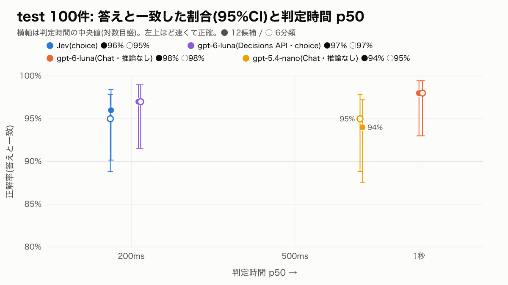
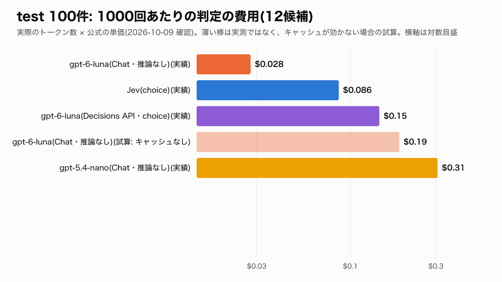
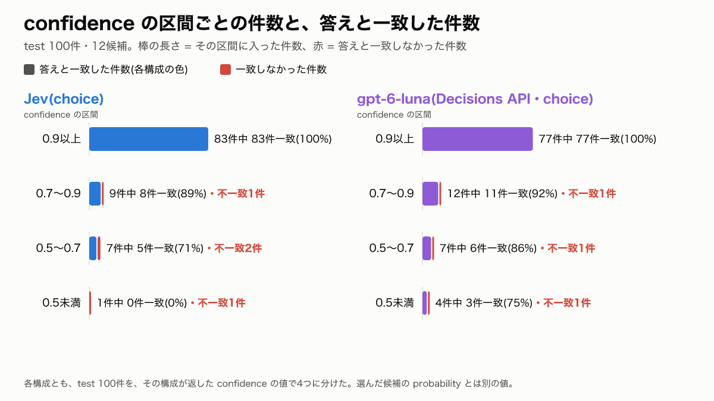

# v4 結果: Jev・Decisions API・通常の LLM 分類器の比較(同じ実行)

**問い: 判断を返す API は、プロンプトの振り分けに使えるか。** 測定計画: [PLAN.md](PLAN.md)(実行前に保存。sha256 は [PLAN.sha256](PLAN.sha256))。計画から変えた点: なし。

## 条件

- 実行: 2026-10-09T12:29:00.070Z 〜 2026-10-09T12:36:59.206Z(UTC)、test 100件 × 4構成 × 2粒度 = 800回(ほかにウォームアップ 3発話 × 8 = 24回)
- 端末: darwin-arm64、Node v24.18.0。SDK: `openai` 7.30.0、`@typesafe-ai/sdk` 0.6.0
- 1件ずつ順番に呼び、並列にはしない。各件で8つの呼び出しの順番を種 20261009 の乱数で並べ替えた。自動リトライ 0回、1回 30秒でタイムアウト。失敗は不正解として採点
- ウォームアップは評価対象外の既存の例(基準書の例の0・1・19番)。採点しない
- 指示文・候補の説明文・会話・正解は v3 で凍結したもの。ハッシュは実行の前と後で一致した
- **test 100件は v3 で結果を見たことのあるデータの再利用。** 新しい独立した未知のデータでの評価ではない。dev は使っていない
- 6分類(補足): 相談(`consult`) = キャリア相談・検索条件・地名・職種の言い換え / 書類作成(`docs`) = 応募書類 / 情報提供(`info`) = 企業情報・クチコミ・給与・待遇 / ハウツー(`howto`) = 面接対策・ログイン・規約・エラー時 / 範囲外(`out_of_scope`) = 範囲外 / 基本(`base`) = 基本。この検証で作ったまとめ方で、本番の分類とは別物

## 発表用の比較表(12候補)

| 構成(test 100件・12候補) | 答えと一致 [95%CI] | 別解込み | p50 / p95 | 費用 / 1000回(実績) |
|---|---:|---:|---:|---:|
| Jev(choice) | 96% [90%–98%] | 98% | 0.18秒 / 0.23秒 | $0.086 |
| gpt-6-luna(Decisions API・choice) | 97% [92%–99%] | 100% | 0.21秒 / 0.31秒 | $0.145 |
| gpt-6-luna(Chat・推論なし) | 98% [93%–99%] | 99% | 1.00秒 / 1.49秒 | $0.028 |
| gpt-5.4-nano(Chat・推論なし) | 94% [88%–97%] | 96% | 0.73秒 / 0.95秒 | $0.307 |



## 正確さ

### 12候補(主な結果)

| 構成 | 返ってきたモデル名 | 答えと一致 [95%CI] | 別解込み [95%CI] | 失敗 |
|---|---|---:|---:|---:|
| Jev(choice) | `jev-1.13.0` | 96% [90%–98%] | 98% [93%–99%] | 0 |
| gpt-6-luna(Decisions API・choice) | `gpt-6-luna` | 97% [92%–99%] | 100% [96%–100%] | 0 |
| gpt-6-luna(Chat・推論なし) | `gpt-6-luna` | 98% [93%–99%] | 99% [95%–100%] | 0 |
| gpt-5.4-nano(Chat・推論なし) | `gpt-5.4-nano-2026-03-17` | 94% [88%–97%] | 96% [90%–98%] | 0 |

### 6分類(補足)

| 構成 | 返ってきたモデル名 | 答えと一致 [95%CI] | 別解込み [95%CI] | 失敗 |
|---|---|---:|---:|---:|
| Jev(choice) | `jev-1.13.0` | 95% [89%–98%] | 98% [93%–99%] | 0 |
| gpt-6-luna(Decisions API・choice) | `gpt-6-luna` | 97% [92%–99%] | 100% [96%–100%] | 0 |
| gpt-6-luna(Chat・推論なし) | `gpt-6-luna` | 98% [93%–99%] | 100% [96%–100%] | 0 |
| gpt-5.4-nano(Chat・推論なし) | `gpt-5.4-nano-2026-03-17` | 95% [89%–98%] | 97% [92%–99%] | 0 |

## 検定(McNemar の正確検定、答えと一致)

### 主な比較群: 12候補の総当たり6組(Holm 補正)

| 比較(A 対 B) | A の一致 | B の一致 | A だけ正解 | B だけ正解 | p(正確検定) | Holm 補正後の p | 判定 |
|---|---:|---:|---:|---:|---:|---:|---|
| Jev 対 Decisions(luna) | 96 | 97 | 3 | 4 | 1.000 | 1.000 | 差があるとは言えない |
| Jev 対 luna Chat | 96 | 98 | 2 | 4 | 0.688 | 1.000 | 差があるとは言えない |
| Jev 対 nano Chat | 96 | 94 | 4 | 2 | 0.688 | 1.000 | 差があるとは言えない |
| Decisions(luna) 対 luna Chat | 97 | 98 | 1 | 2 | 1.000 | 1.000 | 差があるとは言えない |
| Decisions(luna) 対 nano Chat | 97 | 94 | 6 | 3 | 0.508 | 1.000 | 差があるとは言えない |
| luna Chat 対 nano Chat | 98 | 94 | 6 | 2 | 0.289 | 1.000 | 差があるとは言えない |

### 補足の比較群: 6分類の総当たり6組(Holm 補正、主な比較群とは別)

| 比較(A 対 B) | A の一致 | B の一致 | A だけ正解 | B だけ正解 | p(正確検定) | Holm 補正後の p | 判定 |
|---|---:|---:|---:|---:|---:|---:|---|
| Jev 対 Decisions(luna) | 95 | 97 | 1 | 3 | 0.625 | 1.000 | 差があるとは言えない |
| Jev 対 luna Chat | 95 | 98 | 1 | 4 | 0.375 | 1.000 | 差があるとは言えない |
| Jev 対 nano Chat | 95 | 95 | 2 | 2 | 1.000 | 1.000 | 差があるとは言えない |
| Decisions(luna) 対 luna Chat | 97 | 98 | 0 | 1 | 1.000 | 1.000 | 差があるとは言えない |
| Decisions(luna) 対 nano Chat | 97 | 95 | 3 | 1 | 0.625 | 1.000 | 差があるとは言えない |
| luna Chat 対 nano Chat | 98 | 95 | 4 | 1 | 0.375 | 1.000 | 差があるとは言えない |

「差があるとは言えない」は、同等の精度を示すものではない。片方だけが正解した件数が少なく、100件では差を判断できない。

## 速さ(同じ実行の中、成功した呼び出しのみ)

### 12候補

| 構成 | p50 | p95 | p50 の比(この構成 ÷ Jev) | 計測した呼び出し |
|---|---:|---:|---:|---:|
| Jev(choice) | 0.18秒 | 0.23秒 | 1.0 倍 | 100 |
| gpt-6-luna(Decisions API・choice) | 0.21秒 | 0.31秒 | 1.2 倍 | 100 |
| gpt-6-luna(Chat・推論なし) | 1.00秒 | 1.49秒 | 5.6 倍 | 100 |
| gpt-5.4-nano(Chat・推論なし) | 0.73秒 | 0.95秒 | 4.1 倍 | 100 |

### 6分類

| 構成 | p50 | p95 | p50 の比(この構成 ÷ Jev) | 計測した呼び出し |
|---|---:|---:|---:|---:|
| Jev(choice) | 0.18秒 | 0.25秒 | 1.0 倍 | 100 |
| gpt-6-luna(Decisions API・choice) | 0.21秒 | 0.32秒 | 1.2 倍 | 100 |
| gpt-6-luna(Chat・推論なし) | 1.02秒 | 2.38秒 | 5.7 倍 | 100 |
| gpt-5.4-nano(Chat・推論なし) | 0.72秒 | 0.92秒 | 4.0 倍 | 100 |

1台の端末から1回の実行で測った値。一般的な速さや SLA ではない。

## 費用

単価と出典: [PRICING.md](PRICING.md)(2026-10-09 確認)。実績は、API が返した usage × 公式の単価。

### 実績(12候補)

| 構成 | 費用 / 1000回(実績) | 入力 tok / 回 | 出力 tok / 回 | キャッシュ読み出し tok / 回 | キャッシュ書き込み tok / 回 |
|---|---:|---:|---:|---:|---:|
| Jev(choice) | $0.086 | 2,049 | 124.8 | - | - |
| gpt-6-luna(Decisions API・choice) | $0.145 | 1,450 | 0.0 | - | - |
| gpt-6-luna(Chat・推論なし) | $0.028 | 1,442 | 14.5 | 1,389 | 50 |
| gpt-5.4-nano(Chat・推論なし) | $0.307 | 1,442 | 14.5 | 0 | 0 |

### 実績(6分類)

| 構成 | 費用 / 1000回(実績) | 入力 tok / 回 | 出力 tok / 回 | キャッシュ読み出し tok / 回 | キャッシュ書き込み tok / 回 |
|---|---:|---:|---:|---:|---:|
| Jev(choice) | $0.069 | 1,647 | 62.4 | - | - |
| gpt-6-luna(Decisions API・choice) | $0.115 | 1,152 | 0.0 | - | - |
| gpt-6-luna(Chat・推論なし) | $0.024 | 1,123 | 13.4 | 1,070 | 50 |
| gpt-5.4-nano(Chat・推論なし) | $0.241 | 1,123 | 13.4 | 0 | 0 |

- Jev は入力だけに課金(出力は無料)。Decisions API は入力だけに課金(出力・キャッシュは課金なし)。どちらもキャッシュの割引はない
- gpt-6-luna(Chat)は、指示文と候補一覧の部分がキャッシュから読まれ(読み出しは入力単価の0.1倍)、発話の部分が毎回「キャッシュ書き込み」(1.25倍)として返ってきた。gpt-5.4-nano はキャッシュに乗らなかった

### 試算: 通常 API でキャッシュが効かない場合(実測ではない)

計算条件: 返ってきた usage のうち、キャッシュの読み出し・書き込みとされたトークンも、すべて書き込み単価(gpt-6-luna は $0.125 / 1M、書き込み単価のない gpt-5.4-nano は入力単価 $0.20 / 1M)で払ったとする。出力は実績のまま。

**12候補**

| 構成 | 実績 / 1000回 | 試算: キャッシュが効かない場合 / 1000回 |
|---|---:|---:|
| gpt-6-luna(Chat・推論なし) | $0.028 | $0.187 |
| gpt-5.4-nano(Chat・推論なし) | $0.307 | $0.307 |

**6分類**

| 構成 | 実績 / 1000回 | 試算: キャッシュが効かない場合 / 1000回 |
|---|---:|---:|
| gpt-6-luna(Chat・推論なし) | $0.024 | $0.147 |
| gpt-5.4-nano(Chat・推論なし) | $0.241 | $0.241 |



## 確信度(Jev と Decisions API)

### confidence の区間ごとの一致率(12候補)

| 構成 | 区間(confidence) | 件数 | 平均 | 答えと一致 |
|---|---|---:|---:|---:|
| Jev(choice) | 0.5未満 | 1 | 0.44 | 0%(0/1) |
| Jev(choice) | 0.5〜0.7 | 7 | 0.62 | 71%(5/7) |
| Jev(choice) | 0.7〜0.9 | 9 | 0.79 | 89%(8/9) |
| Jev(choice) | 0.9以上 | 83 | 0.99 | 100%(83/83) |
| gpt-6-luna(Decisions API・choice) | 0.5未満 | 4 | 0.46 | 75%(3/4) |
| gpt-6-luna(Decisions API・choice) | 0.5〜0.7 | 7 | 0.61 | 86%(6/7) |
| gpt-6-luna(Decisions API・choice) | 0.7〜0.9 | 12 | 0.83 | 92%(11/12) |
| gpt-6-luna(Decisions API・choice) | 0.9以上 | 77 | 0.97 | 100%(77/77) |

### confidence の区間ごとの一致率(6分類、補足)

| 構成 | 区間(confidence) | 件数 | 平均 | 答えと一致 |
|---|---|---:|---:|---:|
| Jev(choice) | 0.5未満 | 4 | 0.43 | 75%(3/4) |
| Jev(choice) | 0.5〜0.7 | 5 | 0.54 | 40%(2/5) |
| Jev(choice) | 0.7〜0.9 | 14 | 0.84 | 100%(14/14) |
| Jev(choice) | 0.9以上 | 77 | 0.99 | 99%(76/77) |
| gpt-6-luna(Decisions API・choice) | 0.5未満 | 2 | 0.33 | 100%(2/2) |
| gpt-6-luna(Decisions API・choice) | 0.5〜0.7 | 4 | 0.54 | 75%(3/4) |
| gpt-6-luna(Decisions API・choice) | 0.7〜0.9 | 13 | 0.80 | 92%(12/13) |
| gpt-6-luna(Decisions API・choice) | 0.9以上 | 81 | 0.99 | 99%(80/81) |

### 参考: 選んだ候補の probability で区切った場合(12候補)

`confidence` とは別の値。混ぜて読まないこと。

| 構成 | 区間(選んだ候補の probability) | 件数 | 平均 | 答えと一致 |
|---|---|---:|---:|---:|
| Jev(choice) | 0.5未満 | 1 | 0.49 | 0%(0/1) |
| Jev(choice) | 0.5〜0.7 | 5 | 0.62 | 60%(3/5) |
| Jev(choice) | 0.7〜0.9 | 10 | 0.78 | 90%(9/10) |
| Jev(choice) | 0.9以上 | 84 | 0.99 | 100%(84/84) |
| gpt-6-luna(Decisions API・choice) | 0.5未満 | 2 | 0.49 | 100%(2/2) |
| gpt-6-luna(Decisions API・choice) | 0.5〜0.7 | 9 | 0.61 | 78%(7/9) |
| gpt-6-luna(Decisions API・choice) | 0.7〜0.9 | 11 | 0.84 | 91%(10/11) |
| gpt-6-luna(Decisions API・choice) | 0.9以上 | 78 | 0.97 | 100%(78/78) |



確信度0.9以上の件の一致率は、この test 100件の、それぞれの粒度での結果に限った観測。確信度が低いときに別の分類器へ回すと改善するかは、検証していない。

## 誤分類の例(12候補、test の実測)

どれか1つでも答えと一致しなかった件をすべて挙げる。✓ = 答えと一致、△ = 別解と一致、✗ = どちらとも不一致。括弧内は confidence(Jev と Decisions API のみ)。

| id | 発話 | 正解 | Jev | Decisions(luna) | luna Chat | nano Chat |
|---|---|---|---|---|---|---|
| t026 | Lクリニックの職員数と拠点数教えて。あと評判もちょっと気になる | 企業情報(別解: クチコミ) | ✓ 企業情報(0.59) | △ クチコミ(0.47) | ✓ 企業情報 | ✓ 企業情報 |
| t027 | Hテクの資本金っていくらか分かる? | 企業情報 | ✓ 企業情報(1.00) | ✓ 企業情報(0.92) | ✗ 地名・職種の言い換え | ✓ 企業情報 |
| t064 | 面接で希望の待遇を聞かれたとき、休みや手当の希望はどう伝えるのが印象いい? | 面接対策(別解: 給与・待遇) | ✓ 面接対策(0.92) | ✓ 面接対策(0.97) | ✓ 面接対策 | △ 給与・待遇 |
| t072 | 取り下げたら、送った履歴書とかは向こうで消してもらえるの?(直前: U「Yリンクの求人に応募したんだけど、やっぱり辞退しようか迷ってる」 A「応募の取り下げはマイページからできます。ほかに気になる点はありますか?」) | ログイン・規約 | ✓ ログイン・規約(0.67) | ✓ ログイン・規約(0.66) | ✓ ログイン・規約 | ✗ 基本 |
| t079 | サインインは通るのに、マイページ開くたびに勝手にサインアウトされちゃう | エラー時(別解: ログイン・規約) | ✓ エラー時(0.73) | △ ログイン・規約(0.64) | ✓ エラー時 | ✓ エラー時 |
| t085 | 履歴書に大卒って書きたい。実際は中退だけど、バレない書き方にして | 範囲外(別解: 応募書類) | ✓ 範囲外(0.75) | △ 応募書類(0.88) | △ 応募書類 | ✓ 範囲外 |
| t086 | ボーナス出たから投資信託始めようかなって。何買えばいい? | 範囲外 | ✓ 範囲外(0.74) | ✓ 範囲外(0.91) | ✓ 範囲外 | ✗ キャリア相談 |
| t088 | この英文を日本語に訳してほしい。"Thank you for your prompt reply." | 範囲外 | ✗ 基本(0.60) | ✓ 範囲外(0.71) | ✓ 範囲外 | ✗ 基本 |
| t092 | いや、整理するのは今はいいや。また今度にする(直前: U「事務の仕事を探してるんだけど、条件がまだ固まってなくて」 A「それなら、希望の勤務地や働き方を一緒に整理してみましょうか?」) | 基本 | ✗ 検索条件(0.44) | ✓ 基本(0.80) | ✓ 基本 | ✓ 基本 |
| t096 | そういえばあなたってAIなの?名前とかあるの? | 基本(別解: 範囲外) | △ 範囲外(0.60) | ✓ 基本(0.44) | ✓ 基本 | ✓ 基本 |
| t097 | 今日さー、久しぶりに友だちとランチ行ってきたんだよね | 基本(別解: 範囲外) | △ 範囲外(0.73) | ✓ 基本(0.52) | ✓ 基本 | △ 範囲外 |
| t099 | あ、ごめん、水曜じゃなくて木曜だった(直前: U「来週の水曜に時間あるから、その日に求人を見返すね」 A「わかりました。水曜日にまた確認しましょう。」) | 基本 | ✓ 基本(0.85) | ✓ 基本(0.97) | ✓ 基本 | ✗ 検索条件 |

## 失敗した呼び出し

- 800回すべて成功した(失敗0件)

## 言えないこと

- **test 100件は v3 で結果を見たデータの再利用**で、新しい独立したデータでの評価ではない
- test は LLM(claude-sonnet-5-5)が作った発話で、v1〜v3 の dev より長く(平均29.3文字 対 15.8文字)、狙った分類と正解が100件すべて一致した。分類しやすい発話に寄っている可能性がある
- データは合成。正解は Claude Opus 5.5 が基準書 v3 から付けたラベルを人が確認したもの
- 「差があるとは言えない」は「同等の精度」ではない
- 判定時間は1台の端末・1回の実行の観測。時間帯・回線・API 側の混み具合で変わる(同じ gpt-6-luna Chat でも、v3 の 10-04 と appendix の 10-08 で p50 が違った)
- Decisions API はパブリックベータで、精度・速さ・料金は今後変わりうる。使えるモデルは gpt-6-luna だけ
- 選んだあとの回答の品質、確信度が低いときの切り替え、プロンプトの最適化は測っていない
- 会社としての利用の可否、本番での採用、実際のユーザーへの回答の品質は、この検証では確認していない

## 再実行のコマンドと実際の費用

```sh
npx tsx src/v4/eval.ts --set test --dry-run                                               # 見積もり(API を呼ばない)
npx tsx --env-file=.env src/v4/eval.ts --set dev --limit 5 --smoke --budget-usd 0.05      # 動作確認
npx tsx --env-file=.env src/v4/eval.ts --set test --budget-usd 0.40                       # 本評価
npx tsx src/v4/report.ts                                                                  # 集計・summary・グラフ
node src/v4/verify.mjs                                                                    # 生データから独立に再計算して照合
```

| 実行 | 生データ | 呼び出し | 費用(usage × 単価) |
|---|---|---:|---:|
| 動作確認 | `raw/smoke-dev-2026-10-09T12-27-43-n5.json` | 64 | $0.008 |
| 本評価 | `raw/run-test-2026-10-09T12-29-00-n100.json` | 824 | $0.104 |
| 合計 | | | $0.113 |
